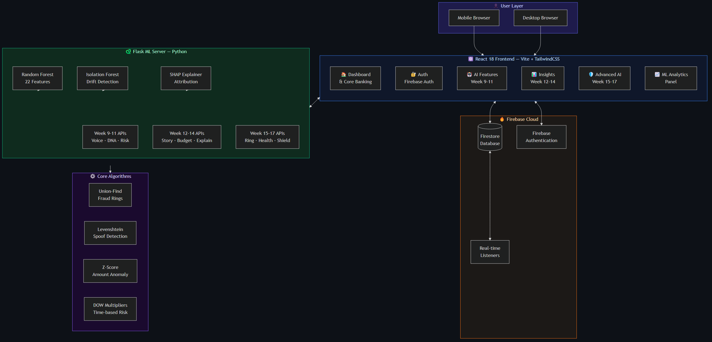
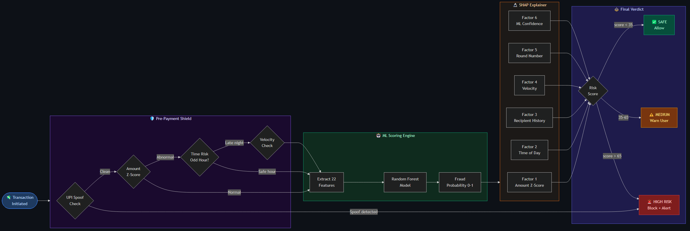
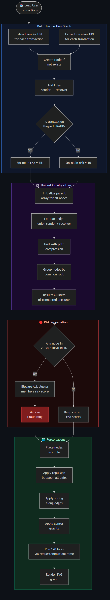
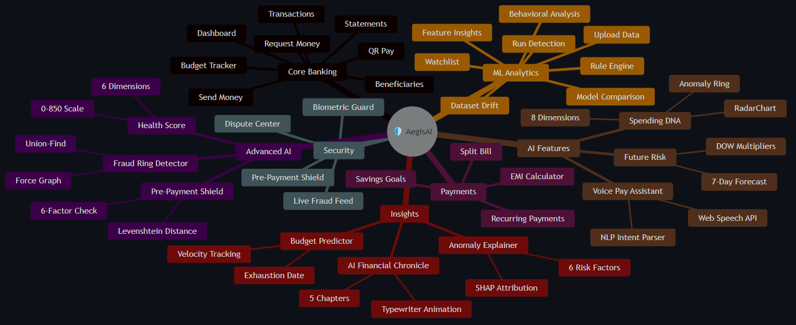
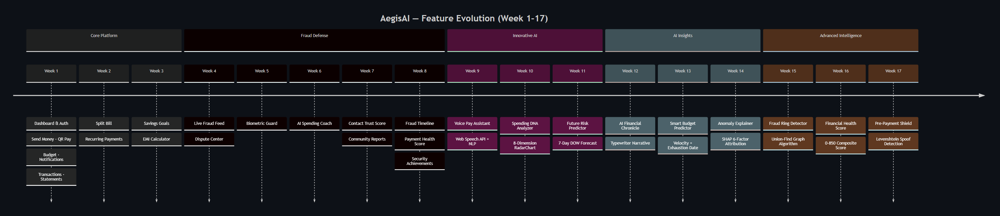

# AegisAI — Intelligent Financial Anomaly Detection System

> **Neural Fraud Defense** · Real-time AI-powered UPI fraud detection, behavioral analytics, and smart financial intelligence

---

## System Design Diagrams

> All diagrams are auto-rendered PNGs from Mermaid source files in `SystemDesignDiagrams/_render/`

### 1. Full System Architecture

> Shows the 5-layer architecture: User → React Frontend → Firebase → Flask ML Server → Algorithm layer

### 2. Fraud Detection Pipeline

> End-to-end flow from transaction initiation through Pre-Payment Shield → ML scoring → SHAP explanation → final verdict

### 3. Payment Journey Sequence

> Sequence diagram showing actor interactions across React, Firebase, and Flask for a complete payment lifecycle

### 4. Fraud Ring Detector Algorithm

> Step-by-step flowchart of Union-Find clustering, risk propagation, and force-directed layout for the graph visualization

### 5. Financial Health Score Model

> How 6 weighted dimensions feed into the 300–850 composite score, letter grade assignment, and improvement action ranking

### 6. Feature Mind Map

> Complete mind map of all 57 features across 17 weeks organized by category

### 7. Data Flow Diagram

> Dual Firestore query strategy, real-time listeners, and API call orchestration between React and Flask

### 8. Feature Evolution Timeline

> Week-by-week timeline from core banking (Week 1) through advanced AI (Week 17)

---

### Legacy Diagrams (Week 1–8)
| Diagram | File |
|---------|------|
| Original System Architecture | `SystemDesignDiagrams/_render/01_SystemArchitecture.png` |
| Fraud Decision Flow | `SystemDesignDiagrams/_render/02_FraudDecisionFlow.png` |
| ML Pipeline | `SystemDesignDiagrams/_render/03_MLPipeline.png` |
| Payment Sequence | `SystemDesignDiagrams/_render/04_PaymentSequence.png` |
| Biometric Sequence | `SystemDesignDiagrams/_render/05_BiometricSequence.png` |
| Component Map | `SystemDesignDiagrams/_render/06_ComponentMap.png` |

---

## Overview

AegisAI is a full-stack intelligent financial security platform built with **React 18**, **Firebase**, and a **Flask + Random Forest ML backend**. It combines traditional fraud detection (ML model scoring) with 17 weeks of progressively advanced features — from core payment flows to graph-based fraud ring detection, SHAP-style anomaly explanation, and Levenshtein UPI spoofing defense.

---

## Tech Stack

| Layer | Technology |
|-------|-----------|
| Frontend | React 18 + Vite, TailwindCSS, shadcn/ui, Framer Motion |
| Charts | Recharts (Area, Radar, Bar, Line, Scatter) |
| Auth & DB | Firebase Auth + Firestore |
| Backend | Python Flask, Flask-CORS |
| ML Model | Random Forest (22 features, `.pkl`) + Isolation Forest |
| Algorithms | Union-Find, Levenshtein distance, SHAP-style attribution, force-directed graph layout |
| Voice | Web Speech API (`SpeechRecognition`, `en-IN`) |
| Animations | Framer Motion, SVG stroke-dashoffset, requestAnimationFrame springs |

---

## Project Highlights

| Metric | Value |
|--------|-------|
| Total React components | 70+ |
| Frontend routes | 57 |
| Flask API endpoints | 50+ |
| Firestore collections | 10 |
| ML model features | 22 |
| Weeks of features | 17 |
| Unique AI/ML algorithms | 8 |
| Animation systems | SVG gauge, typewriter, force-graph, waveform |

---

## Feature Roadmap

### Core Banking (Week 1)

| Feature | Route | Description |
|---------|-------|-------------|
| Dashboard | `/dashboard` | Balance overview, recent transactions, live fraud alerts |
| Send Money | `/send-money` | UPI payment flow with real-time fraud pre-check |
| QR Pay | `/qr-pay` | QR code scanner and generator for instant payments |
| Request Money | `/request-money` | Generate and share UPI payment request links |
| Budget Tracker | `/budget` | Monthly budget categories with spend tracking |
| AI Assistant | `/ai-assistant` | Conversational AI for financial queries |
| Notifications | `/notifications` | Real-time alerts for transactions and fraud events |
| Transactions | `/transactions` | Full paginated transaction history with filters |
| Statements | `/statements` | Monthly statement generation and export |
| Beneficiaries | `/beneficiaries` | Manage saved UPI contacts |
| Settings | `/settings` | Account preferences and security settings |
| Help & Support | `/help-support` | FAQs, chat support, and ticket system |

---

### Week 2 — Collaborative Payments

| Feature | Route | Description |
|---------|-------|-------------|
| Split Bill | `/split-bill` | Equally or custom-split expenses across multiple contacts |
| Recurring Payments | `/recurring-payments` | Schedule and manage periodic automatic payments |

---

### Week 3 — Financial Planning

| Feature | Route | Description |
|---------|-------|-------------|
| Savings Goals | `/savings-goals` | Set and track progress toward named savings targets |
| EMI Calculator | `/emi-calculator` | Compute loan EMIs with full amortization schedule |

---

### Week 4 — Live Fraud Defense

| Feature | Route | Description |
|---------|-------|-------------|
| Live Fraud Feed | `/live-fraud-feed` | Real-time stream of fraud events across the platform |
| Dispute Center | `/dispute-center` | Raise, track, and resolve transaction disputes |

---

### Week 5 — Biometric Security

| Feature | Route | Description |
|---------|-------|-------------|
| Biometric Guard | `/biometric-guard` | Device biometric authentication simulation with full audit log |

---

### Week 6 — AI Coaching

| Feature | Route | Description |
|---------|-------|-------------|
| Spending Coach | `/spending-coach` | AI-generated weekly spending insights with dual Firestore query fix |

---

### Week 7 — Social Trust

| Feature | Route | Description |
|---------|-------|-------------|
| Contact Trust Score | `/contact-trust` | Per-contact risk scoring based on full transaction history |
| Community Reports | `/community-reports` | Crowdsourced UPI fraud reports with heat ranking |

---

### Week 8 — Fraud Intelligence

| Feature | Route | Description |
|---------|-------|-------------|
| Fraud Timeline | `/fraud-timeline` | Chronological view of predicted fraud events |
| Payment Health | `/payment-health` | Per-payment safety score with weekly trend graph |
| Security Achievements | `/security-badges` | Gamified badges rewarding secure payment behavior |

---

### Week 9–11 — Innovative AI Features

| Week | Feature | Route | Key Technology |
|------|---------|-------|----------------|
| 9 | **Voice Pay Assistant** | `/voice-pay` | Web Speech API, regex NLP intent parser, 28-bar Framer Motion waveform |
| 10 | **Spending DNA Analyzer** | `/spending-dna` | 8-dimension behavioral profile, RadarChart baseline vs current, SVG anomaly ring |
| 11 | **Future Risk Predictor** | `/future-risk` | Day-of-week ML multipliers (Sun 1.4×, Sat 1.5×, Mon 0.7×), 7-day forecast AreaChart |

**Voice Pay** understands natural language commands like:
- *"Send five hundred to Rahul for dinner"*
- *"Pay one thousand to priya@upi"*
- *"Check my balance"*
- *"Show my transactions"*

**Spending DNA** computes 8 behavioral dimensions — Food, Shopping, Transport, Entertainment, Healthcare, Utilities, Education, Other — and flags dimensions with ≥15% shift from your personal baseline with an animated SVG anomaly ring.

**Future Risk** forecasts fraud probability for any UPI ID across the next 7 days using 4 scoring factors (velocity, amount, fraud history, community reports) multiplied by day-of-week risk weights.

Flask endpoints: `POST /voice-parse` · `POST /spending-dna` · `GET|POST /future-risk/<upi_id>`

---

### Week 12–14 — AI-Driven Insights

| Week | Feature | Route | Key Technology |
|------|---------|-------|----------------|
| 12 | **AI Financial Chronicle** | `/financial-story` | Typewriter-animated 5-section narrative from real transaction data |
| 13 | **Smart Budget Predictor** | `/budget-predictor` | Daily velocity tracking, month-end projection curve, budget exhaustion date |
| 14 | **Transaction Anomaly Explainer** | `/anomaly-explainer` | SHAP-style 6-factor attribution, SVG risk score ring, split-panel forensic UI |

**AI Financial Chronicle** generates a personalized monthly story with 5 chapters:
1. Opening Chapter — transaction volume and financial footprint
2. The Spending Story — category breakdown and average transaction analysis
3. Standout Transaction — largest payment with fraud verdict
4. Security Report — fraud exposure rate and flagged transaction summary
5. Closing Insights — month-end assessment and next-month tips

All rendered with character-by-character typewriter animation via Framer Motion.

**Smart Budget Predictor** computes:
- Daily spend velocity (₹ per day elapsed)
- Projected month-end total vs auto-detected or manual budget
- Exact exhaustion date when velocity exceeds safe daily limit
- Safe daily spend allowance for remaining days
- Burn rate bar with risk levels: Safe / Watch Out / Over Budget / Critical
- Category breakdown and day-of-week average spend heatmap

**Transaction Anomaly Explainer** SHAP-style 6-factor breakdown:
1. Transaction Amount — Z-score vs personal average
2. Time of Transaction — late-night (0–5 AM) detection
3. Recipient Profile — first-time vs known recipient
4. Velocity — rapid succession within 60-minute window
5. Round Number Pattern — round amounts as scripted fraud signal
6. ML Model Confidence — trained Random Forest fraud probability

Flask endpoints: `POST /financial-story` · `POST /budget-predict` · `POST /explain-transaction`

---

### Week 15–17 — Advanced Intelligence

| Week | Feature | Route | Key Technology |
|------|---------|-------|----------------|
| 15 | **Fraud Ring Detector** | `/fraud-ring` | Union-Find clustering, SVG force-directed graph, pan/zoom/drag, risk propagation |
| 16 | **Financial Health Score** | `/health-score` | 0–850 composite score, 6-dimension radar, 4-week trend chart, letter grade A+→D |
| 17 | **Pre-Payment Shield** | `/prepayment-shield` | Levenshtein UPI spoofing check, 6-factor real-time gate, Green/Yellow/Red verdict |

**Fraud Ring Detector** builds an interactive transaction network graph:
- Nodes = UPI accounts, colored by risk (indigo = you, green = safe, amber = medium, red = high)
- Edges = transactions (solid for safe, dashed red for flagged)
- **Union-Find algorithm** clusters all connected accounts into groups
- Risk propagation: HIGH_RISK nodes elevate scores of all accounts in their cluster
- Detected fraud rings listed in a table with one-click node navigation
- Full pan, zoom (mouse wheel), and drag support with SVG canvas

**Financial Health Score** (credit-score style 300–850) across 6 weighted dimensions:

| Dimension | Weight | What It Measures |
|-----------|--------|-----------------|
| Fraud Exposure | 25% | Proportion of safe vs flagged transactions |
| Budget Adherence | 20% | Week-to-week spending variance stability |
| Spending Consistency | 15% | Transaction amount standard deviation ratio |
| Recipient Diversity | 15% | Breadth of unique payment contacts |
| Savings Rate | 15% | Total spend relative to financial capacity proxy |
| Payment Velocity | 10% | Time-of-day transaction spread |

Includes: animated SVG arc gauge, letter grade badge (A+→D), 4-week trend AreaChart, RadarChart, score band reference table, and ranked improvement action list.

**Pre-Payment Shield** — real-time risk gate before every send:
- **Levenshtein distance** against all known contacts — detects 1–2 character swaps like `rahu1@upi` vs `rahul@upi`
- Recipient transaction history check (prior fraud flags surface immediately)
- Amount Z-score against personal spending baseline
- Late-night (0–5 AM) and high-risk day-of-week multipliers
- Rapid succession detection within 30-minute window
- Round-number pattern flag (₹500, ₹1000, ₹5000)
- Final verdict: `ALLOW` (green) / `CAUTION` (amber) / `BLOCK` (red) with confidence %
- Recent checks history with one-click re-run

Flask endpoints: `POST /fraud-ring-analysis` · `POST /financial-health` · `POST /prepayment-check`

---

## ML Analytics Panel

Dedicated sidebar section for data science and model management workflows:

| Feature | Route | Description |
|---------|-------|-------------|
| Upload Data | `/upload-data` | Upload CSV transaction datasets |
| Explore Data | `/explore-data` | Statistical summary, distributions, correlation matrix |
| Run Detection | `/run-detection` | Execute fraud detection on uploaded dataset |
| Detection Results | `/detection-results` | Confusion matrix, ROC curve, precision/recall/F1 |
| Model Comparison | `/model-comparison` | Side-by-side benchmark across multiple algorithms |
| Check Transaction | `/check-transaction` | Single transaction manual risk scoring |
| Batch Check | `/batch-check` | Bulk transaction scoring via CSV upload |
| AI Hub | `/ai-hub` | Central hub for all AI model capabilities |
| Feature Insights | `/feature-insights` | SHAP feature importance visualization |
| Bulk Explain | `/bulk-explain` | Batch SHAP explanations for multiple records |
| Score History | `/score-history` | Historical fraud score trend and distribution |
| Watchlist | `/watchlist` | Monitored high-risk UPI accounts with alerts |
| Fraud Calendar | `/fraud-calendar` | Calendar heatmap of fraud activity over time |
| Network Analysis | `/network-analysis` | Advanced UPI transaction network graph |
| Dataset Drift | `/dataset-drift` | Statistical drift detection between datasets |
| Retrain Readiness | `/retraining-readiness` | Signal when model performance needs refresh |
| Behavioral Analysis | `/behavioral-analysis` | User behavioral clustering and anomaly patterns |
| Rule Engine | `/rule-engine` | Configurable rule-based fraud filter builder |
| Risk Score Blend | `/risk-score-blend` | Weighted ensemble of multiple risk signals |
| Feedback Center | `/feedback-center` | Human-in-the-loop fraud label corrections |

---

## Flask API Reference

### Core ML Endpoints
| Method | Endpoint | Description |
|--------|----------|-------------|
| POST | `/predict` | Single transaction fraud score via Random Forest |
| POST | `/predict-batch` | Batch transaction scoring |
| POST | `/upload-csv` | Upload and parse transaction dataset |
| POST | `/run-detection` | Run full detection pipeline on stored dataset |
| GET | `/detection-results` | Retrieve latest detection run results |
| POST | `/explain` | SHAP explanation for single transaction |
| POST | `/bulk-explain` | Batch SHAP explanations |
| GET | `/feature-importance` | RF feature importance scores |
| POST | `/dataset-drift` | Statistical drift analysis between two datasets |
| GET | `/score-history` | Historical fraud score log |
| POST | `/behavioral-analysis` | Behavioral pattern clustering |
| POST | `/model-comparison` | Multi-model benchmark |
| POST | `/rule-engine` | Evaluate configurable fraud rules |
| POST | `/risk-score-blend` | Weighted multi-signal score aggregation |

### Week 9–11 Endpoints
| Method | Endpoint | Description |
|--------|----------|-------------|
| POST | `/voice-parse` | NLP intent parsing for voice payment commands |
| POST | `/spending-dna` | 8-dimension behavioral DNA profile + anomaly score |
| GET/POST | `/future-risk/<upi_id>` | 7-day fraud risk forecast with DOW multipliers |

### Week 12–14 Endpoints
| Method | Endpoint | Description |
|--------|----------|-------------|
| POST | `/financial-story` | Generate 5-chapter narrative financial chronicle |
| POST | `/budget-predict` | Velocity-based budget exhaustion forecast |
| POST | `/explain-transaction` | SHAP-style forensic attribution for one transaction |

### Week 15–17 Endpoints
| Method | Endpoint | Description |
|--------|----------|-------------|
| POST | `/fraud-ring-analysis` | Union-Find fraud cluster detection on transaction graph |
| POST | `/financial-health` | Compute 0–850 composite financial health score |
| POST | `/prepayment-check` | Pre-send risk gate with Levenshtein spoof detection |

---

## Firestore Collections

| Collection | Key Fields |
|-----------|-----------|
| `users` | uid, upiId, name, email, balance |
| `transactions` | userId, senderUPI, receiverUPI, amount, timestamp, fraudVerdict, fraudScore, category |
| `beneficiaries` | userId, name, upiId, nickname |
| `notifications` | userId, type, message, read, timestamp |
| `disputes` | userId, transactionId, reason, status, createdAt |
| `savingsGoals` | userId, name, targetAmount, currentAmount, deadline |
| `recurringPayments` | userId, receiverUPI, amount, frequency, nextDate |
| `watchlist` | userId, upiId, reason, addedAt, riskLevel |
| `communityReports` | upiId, reportCount, lastReported, category |
| `feedbackLabels` | transactionId, humanLabel, modelLabel, timestamp |

---

## Key Algorithms

| Algorithm | Used In | Purpose |
|-----------|---------|---------|
| Random Forest (22 features) | Core ML backend | Fraud probability scoring |
| Isolation Forest | Dataset drift, anomaly detection | Unsupervised outlier detection |
| Union-Find (Disjoint Set) | Fraud Ring Detector | Cluster connected account networks |
| Levenshtein Distance | Pre-Payment Shield | Detect UPI ID spoofing and impersonation |
| SHAP-style Attribution | Anomaly Explainer, /explain endpoint | Explain which features drive fraud score |
| Force-directed Spring Layout | Fraud Ring graph | Auto-layout transaction network nodes |
| Day-of-week Risk Multipliers | Future Risk Predictor | Temporal fraud probability weighting |
| Z-score Normalization | Budget Predictor, Pre-Payment Shield | Detect spend anomalies vs personal baseline |

---

## Project Structure

```
Intelligent-Financial-Anomaly-Detection-System/
├── fraudAI_Frontend_React/
│   └── src/
│       └── components/logic/
│           ├── firebase.js
│           ├── SidebarContent.jsx         ← AegisAI brand + all 57 nav items
│           ├── Dashboard.jsx
│           │
│           ├── ── Week 1 Core ──
│           ├── SendMoney.jsx / QRPay.jsx / Budget.jsx
│           ├── AIAssistant.jsx / NotificationsCenter.jsx
│           ├── Recent.jsx / Statements.jsx / Beneficiaries.jsx
│           │
│           ├── ── Week 2–8 ──
│           ├── SplitBill.jsx / RecurringPayments.jsx
│           ├── SavingsGoals.jsx / EMICalculator.jsx
│           ├── LiveFraudFeed.jsx / DisputeCenter.jsx
│           ├── BiometricGuard.jsx / SpendingCoach.jsx
│           ├── ContactTrustScore.jsx / CommunityReports.jsx
│           ├── FraudTimeline.jsx / PaymentHealth.jsx / SecurityBadges.jsx
│           │
│           ├── ── Week 9–11 Innovative ──
│           ├── VoicePayAssistant.jsx      ← Web Speech API + NLP
│           ├── SpendingDNA.jsx            ← 8-dim RadarChart + SVG ring
│           ├── FutureRiskPredictor.jsx    ← 7-day DOW forecast
│           │
│           ├── ── Week 12–14 AI Insights ──
│           ├── AIFinancialStory.jsx       ← typewriter narrative
│           ├── BudgetPredictor.jsx        ← velocity + exhaustion date
│           ├── AnomalyExplainer.jsx       ← SHAP split-panel forensics
│           │
│           └── ── Week 15–17 Advanced ──
│               ├── FraudRingDetector.jsx  ← Union-Find + force graph
│               ├── FinancialHealthScore.jsx ← 0–850 credit-style score
│               └── PrePaymentShield.jsx   ← Levenshtein spoof check
│
├── AI_model_server_Flask/
│   └── app.py                            ← 50+ endpoints, RF model, all APIs
│
├── SystemDesignDiagrams/
│   ├── ARCHITECTURE.md
│   ├── SEQUENCE_DIAGRAMS.md
│   ├── DATA_FLOW.md
│   ├── COMPONENT_MAP.md
│   └── _render/
│       ├── 01_SystemArchitecture.png
│       ├── 02_FraudDecisionFlow.png
│       ├── 03_MLPipeline.png
│       ├── 04_PaymentSequence.png
│       ├── 05_BiometricSequence.png
│       └── 06_ComponentMap.png
│
└── README.md
```

---

## Getting Started

### Frontend

```bash
cd fraudAI_Frontend_React
npm install
npm run dev
# → http://localhost:5173
```

### Backend (Flask)

```bash
cd AI_model_server_Flask
pip install flask flask-cors scikit-learn pandas numpy
python app.py
# → http://127.0.0.1:5000
```

### Firebase Setup

Create `src/components/logic/firebase.js` with your Firebase project config:

```js
import { initializeApp } from 'firebase/app';
import { getAuth } from 'firebase/auth';
import { getFirestore } from 'firebase/firestore';

const firebaseConfig = {
  apiKey: "YOUR_API_KEY",
  authDomain: "YOUR_PROJECT.firebaseapp.com",
  projectId: "YOUR_PROJECT_ID",
  storageBucket: "YOUR_PROJECT.appspot.com",
  messagingSenderId: "YOUR_SENDER_ID",
  appId: "YOUR_APP_ID",
};

const app = initializeApp(firebaseConfig);
export const auth = getAuth(app);
export const db = getFirestore(app);
```

---

## Brand

**AegisAI** — named after the aegis (the divine shield), representing AI-powered financial protection for every transaction.

- Logo: Hexagonal neural node SVG with cyan→violet gradient + live pulse badge
- Tagline: *Neural Fraud Defense*
- Sidebar: AegisAI wordmark with "AI Engine Live" real-time status indicator

---

*Built with React 18 · Firebase · Python Flask · Random Forest · Framer Motion · Recharts*
