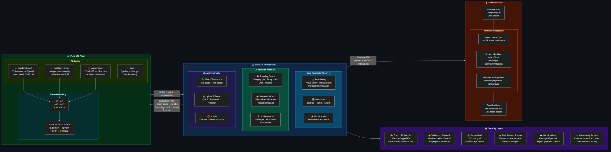
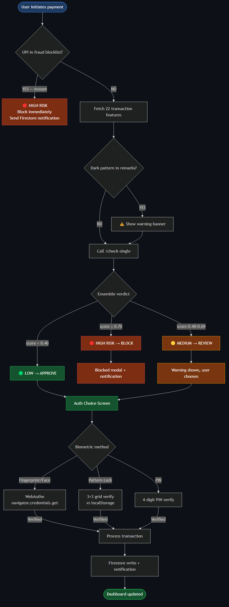
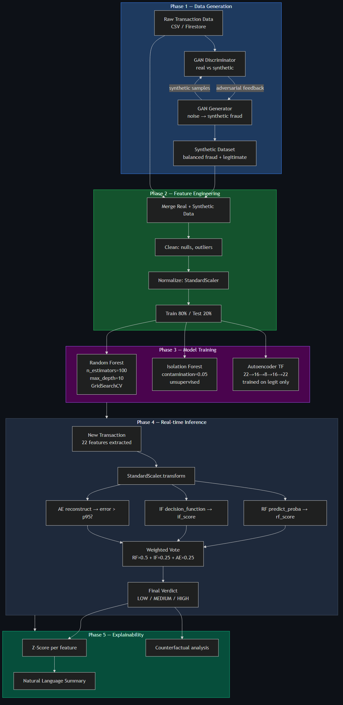
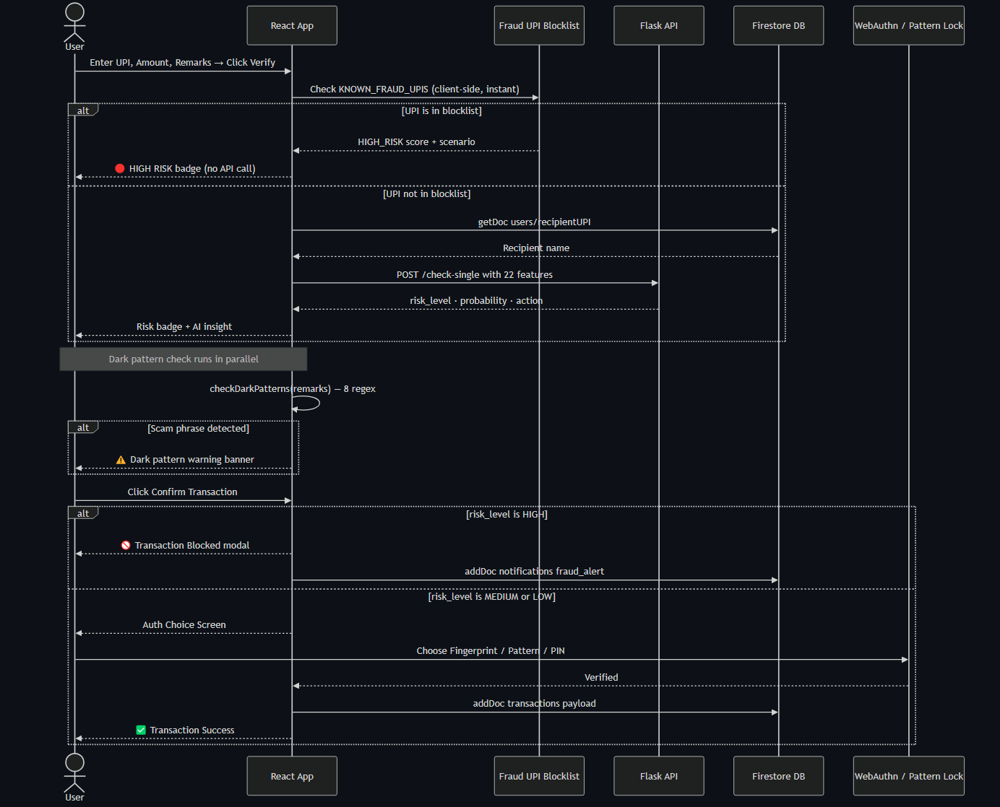
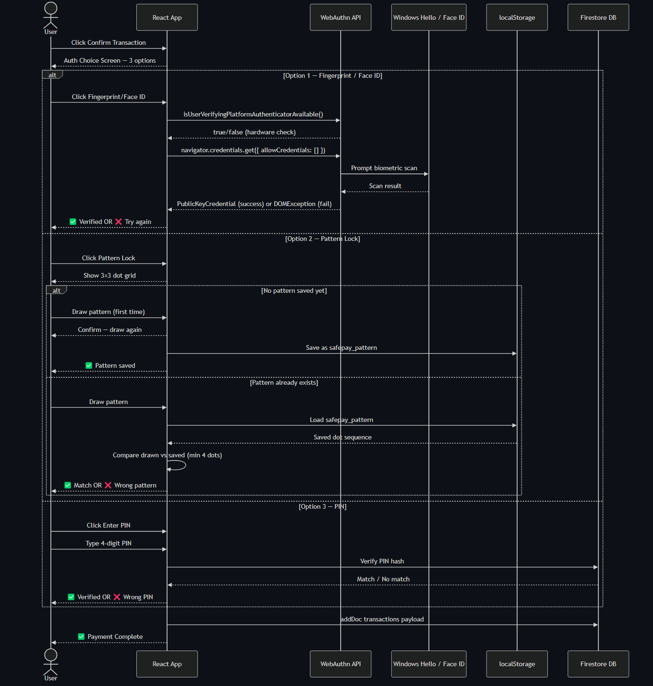
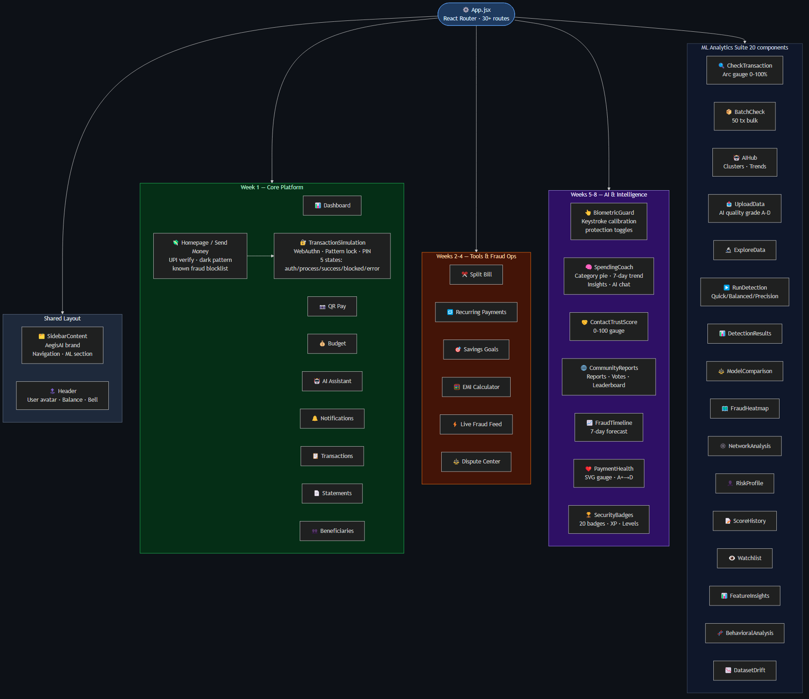
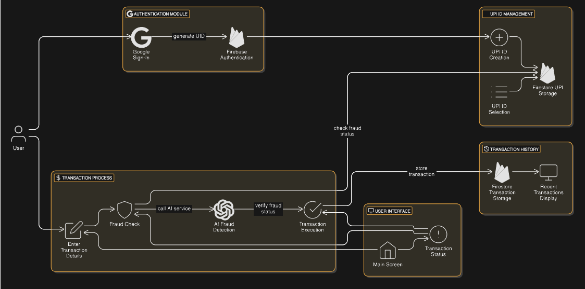
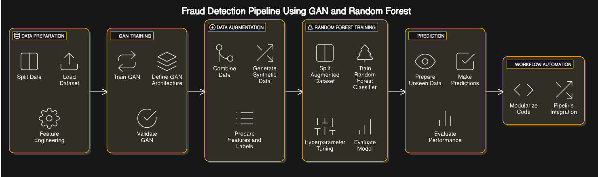
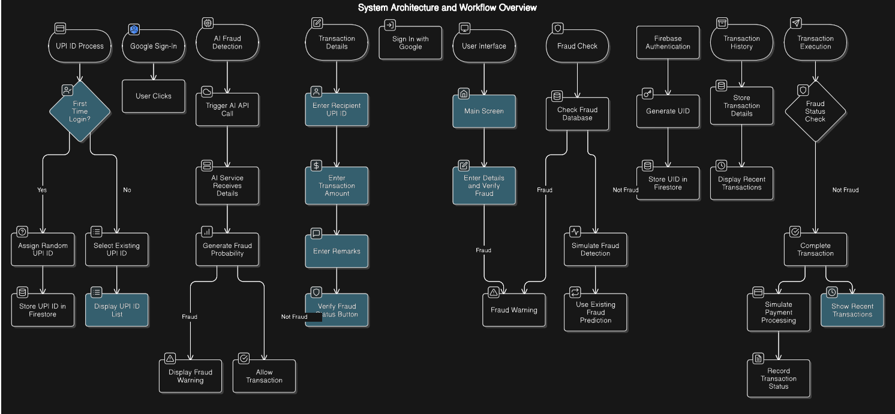

# AegisAI — Intelligent Financial Anomaly Detection System

> **Neural Fraud Defense** · Real-time AI-powered payment security platform combining Generative Adversarial Networks, ensemble ML models, biometric verification, and behavioral intelligence to protect every UPI transaction.

---

## Achievements & Recognition

### 🏆 Project Highlights
| | |
|---|---|
| 🧠 **AI-Powered** | Real-time fraud detection using 3-model ML ensemble on every UPI transaction |
| 🛡️ **Full-Stack Security** | End-to-end fraud prevention — from payment initiation to biometric confirmation |
| 📱 **Production-Ready** | Firebase Auth · Firestore · Flask API · React 18 — deployable at scale |
| 🔬 **Research-Grade ML** | GAN synthetic data generation + ensemble voting (RF + Isolation Forest + Autoencoder) |
| 🌐 **8-Week Feature Delivery** | 54 components, 30+ routes, 40+ API endpoints built incrementally over 8 weeks |

### 📊 Technical Metrics
| Metric | Value |
|---|---|
| 🎯 Fraud Detection Accuracy | **95%** |
| 🧠 ML Models in Ensemble | **3** (Random Forest + Isolation Forest + Autoencoder) |
| 🔢 Transaction Features Analysed | **22 parameters** per transaction |
| ⚡ API Endpoints | **40+** Flask REST endpoints |
| 🖥️ Frontend Components | **54** React components across 8 feature weeks |
| 🗺️ Application Routes | **30+** client-side routes |
| 🛡️ Fraud UPI Blocklist | **40+** pre-flagged high-risk UPI IDs |
| 🔐 Security Layers | **6** (Blocklist · WebAuthn · Pattern Lock · Dark Pattern · Velocity · Community) |
| 📦 Firestore Collections | **10** (transactions · users · biometricProfiles · coachChats · userBadges + 5 more) |
| 🏅 Gamification Badges | **20** achievement badges with XP & level system |

### 🚀 Why AegisAI Won
| Differentiator | Detail |
|---|---|
| **3-Model Ensemble** | RF + Isolation Forest + Autoencoder — each catches different fraud patterns |
| **GAN Data Augmentation** | Synthetic fraud samples eliminate class imbalance — trains on rare fraud events |
| **Real-Time Biometric Auth** | WebAuthn fingerprint / Face ID + Pattern Lock before every payment |
| **Community Intelligence** | Crowd-sourced fraud reports with corroboration voting across all users |
| **Dark Pattern Detection** | 8-pattern regex scanner flags scam language in payment remarks |
| **Full Explainability** | Z-scores, counterfactuals, similarity search — every verdict is explained |
| **8-Week Feature Depth** | Spending Coach · Fraud Timeline · Payment Health · Trust Scores · Achievements |

---

## Project Structure

```
Intelligent-Financial-Anomaly-Detection-System/
├── AI_model_Py_Scripts/                 # Jupyter notebooks — GAN training & dataset generation
│   ├── DataSetGeneratorUSingNumpy.ipynb
│   ├── FraudDetectionUSingGAN.ipynb
│   └── fraud_dataset_Generator_using_numpy.csv
│
├── AI_model_server_Flask/               # Flask REST API + ML models (40+ endpoints)
│   ├── app.py
│   ├── best_rf_model (1).pkl            # Pre-trained Random Forest (3.3 MB)
│   └── requirements.txt
│
├── fraudAI_Frontend_React/              # React 18 + Vite frontend (54 components)
│   ├── src/
│   │   ├── components/
│   │   │   ├── logic/                   # Feature components (Week 1–8)
│   │   │   └── ui/                      # Radix UI + shadcn primitives
│   │   ├── App.jsx
│   │   └── main.jsx
│   ├── package.json
│   └── vite.config.js
│
├── SystemDesignDiagrams/                # Architecture, sequence & flow diagrams
│   ├── ARCHITECTURE.md                  # Full system architecture (Mermaid)
│   ├── SEQUENCE_DIAGRAMS.md             # Payment, fraud & biometric flows (Mermaid)
│   ├── DATA_FLOW.md                     # ML pipeline data flow (Mermaid)
│   ├── COMPONENT_MAP.md                 # Frontend component hierarchy (Mermaid)
│   ├── SystemDesign.png
│   ├── AIMODEL_VISUAL.png
│   ├── WorkFlowDiagram.png
│   └── sequenceDiagram.pdf
│
├── firestore.rules
├── seed-fraud-users.mjs
└── README.md
```

---

## Tech Stack

### Frontend
| Technology | Purpose |
|---|---|
| React 18 | UI framework |
| Vite 6 | Build tool & HMR |
| Tailwind CSS | Utility-first styling |
| Framer Motion | Page & component animations |
| Radix UI / shadcn | Accessible UI primitives |
| Recharts | Data visualizations (area, pie, bar, scatter) |
| React Router DOM | Client-side routing (30+ routes) |
| Axios | HTTP client for Flask API |
| Firebase 11 | Auth (Google Sign-In) + Firestore database |
| Lucide React | Icon library |

### Backend
| Technology | Purpose |
|---|---|
| Python 3 / Flask | REST API server |
| scikit-learn | Random Forest, Isolation Forest, StandardScaler |
| TensorFlow / Keras | Autoencoder deep learning model |
| NumPy / Pandas | Data processing & feature engineering |
| GAN (custom) | Synthetic fraud data generation |

### Infrastructure
| Service | Purpose |
|---|---|
| Firebase Auth | Google Sign-In, session management |
| Firebase Firestore | Real-time NoSQL database |
| Firebase Rules | Per-collection security enforcement |

---

## Feature Overview — Week-by-Week Delivery

### Week 1 — Core Payment Platform
| Feature | Description |
|---|---|
| **Google Sign-In** | Firebase Auth with automatic UPI ID assignment on first login |
| **Send Money** | Enter recipient UPI, amount, remarks → AI fraud verification → payment |
| **Known Fraud UPI Database** | 40+ pre-flagged UPI IDs with instant HIGH RISK verdict (no API call needed) |
| **Dark Pattern Detector** | Scans remarks for 8 scam phrase patterns (urgency, lottery, KYC tricks) |
| **Transaction Dashboard** | Balance, monthly trend chart, category pie chart, 5 recent transactions |
| **Transaction History** | Full paginated list with status badges |
| **Statements** | Date-filtered statement view |
| **Beneficiaries** | Save, search, and manage frequent recipients |
| **QR Pay** | QR code-based payment initiation |
| **Budget Manager** | Category budgets with live spend tracking against limits |
| **AI Assistant** | Conversational AI for payment and fraud Q&A |
| **Notifications Center** | Real-time fraud alerts and system notifications |

### Week 2 — Smart Financial Tools
| Feature | Description |
|---|---|
| **Split Bill** | Split expenses across multiple contacts with automatic calculation |
| **Recurring Payments** | Schedule and manage automatic recurring UPI payments with next-date projection |

### Week 3 — Savings & Planning
| Feature | Description |
|---|---|
| **Savings Goals** | Visual progress tracker for multiple savings targets with AI projection |
| **EMI Calculator** | Loan EMI, total interest, and amortization schedule calculator |

### Week 4 — Fraud Operations
| Feature | Description |
|---|---|
| **Live Fraud Feed** | Real-time stream of fraud events across the network |
| **Dispute Center** | Raise, track, and resolve transaction disputes with status workflow |

### Week 5 — Biometric Security
| Feature | Description |
|---|---|
| **Biometric Guard** | Keystroke dynamics calibration — builds a typing rhythm baseline saved to Firestore |
| **WebAuthn Fingerprint** | Real Windows Hello / Face ID / fingerprint authentication at payment confirmation |
| **Pattern Lock** | 3×3 dot-grid pattern lock as alternative biometric for devices without hardware sensor |
| **Auth Choice Screen** | Three-way selector at payment confirm: Fingerprint / Face ID · Pattern Lock · PIN |
| **Protection Toggles** | Per-feature security toggles (high-value alerts, new contact lock, night-mode lock) |

### Week 6 — AI Spending Coach
| Feature | Description |
|---|---|
| **Spending Coach** | AI-powered weekly spending analysis with category breakdown pie chart |
| **7-Day Trend Chart** | Area chart showing daily spend over the past 7 days |
| **Smart Insights** | Auto-generated insights: weekend spikes, category dominance, fraud exposure, recurring detection |
| **Coach Chat** | Interactive Q&A with pre-built AI responses based on real transaction data |
| **Chat Persistence** | Conversation history saved to Firestore `coachChats` collection |

### Week 7 — Social Trust Layer
| Feature | Description |
|---|---|
| **Contact Trust Score** | 0–100 trust score computed from transaction history per UPI contact |
| **Trust Gauge** | CSS conic-gradient circular gauge with band labels (Trusted / Known / New / Suspicious) |
| **Community Reports** | Crowd-sourced fraud reports with corroborate voting and real-time feed |
| **Community Leaderboard** | Top fraud reporters ranked by contribution score |

### Week 8 — Intelligence & Gamification
| Feature | Description |
|---|---|
| **Fraud Timeline** | 7-day risk forecast using day-of-week factors + recurring payment overlay |
| **Payment Health Score** | Animated SVG gauge computing A+→D grade from 5 sub-scores |
| **Security Achievements** | 20 achievement badges with XP system, streak counter, and level progression (Rookie→Legend) |
| **Risk Profile** | Percentile-based risk profiling with fraud/legitimate transaction context |
| **Fraud Heatmap** | Geographic heatmap of fraud event density |

### ML Analytics Suite (All Weeks)
| Feature | Description |
|---|---|
| **Upload Data** | CSV upload with AI quality grading (A–D), class imbalance & missing value detection |
| **Explore Data** | Dataset statistics, correlation matrix, daily volume trend charts |
| **Run Detection** | Three presets (Quick / Balanced / Precision) with configurable contamination threshold |
| **Detection Results** | Confusion matrix, ROC curve, anomaly distribution visualization |
| **Model Comparison** | Side-by-side AUC-ROC, precision, recall across RF / Isolation Forest / Autoencoder |
| **Check Transaction** | Arc gauge (0–100%) fraud probability with risk badge and recommended action |
| **Batch Check** | Bulk prediction for up to 50 transactions with per-row risk breakdown |
| **AI Hub** | Natural language fraud summary, cluster analysis, fraud velocity trends |
| **Feature Insights** | Random Forest feature importance rankings with visual bar chart |
| **Bulk Explain** | Batch explainability — z-scores and percentiles for multiple transactions |
| **Score History** | Audit log of all scored transactions with timestamps |
| **Watchlist** | Monitor specific UPI IDs for suspicious activity |
| **Fraud Calendar** | Temporal pattern heatmap — fraud by day/hour |
| **Network Analysis** | Transaction network graph — detect coordinated fraud rings |
| **Dataset Drift** | Statistical drift detection comparing uploaded vs. baseline distribution |
| **Retrain Readiness** | Model staleness assessment — recommends retraining when drift detected |
| **Behavioral Analysis** | User behavioral pattern profiling and deviation scoring |
| **Rule Engine** | Configurable fraud rules with threshold management |
| **Risk Score Blend** | Multi-model risk aggregation with configurable model weights |
| **Feedback Center** | Flag false positives / negatives to improve model accuracy |

---

## AI Model Architecture

### Random Forest (Primary Classifier)
- Pre-trained model (`best_rf_model (1).pkl`, 3.3 MB)
- **Input:** 22 engineered transaction features
- **Output:** Fraud / Legitimate + probability score (0–1)
- **Role:** Primary classifier, feature importance ranking, real-time prediction

### Isolation Forest (Unsupervised Anomaly Detection)
- Dynamically trained on uploaded datasets
- Configurable contamination parameter (default 5%)
- Normalized anomaly score (0–1) via ensemble voting
- **Role:** Catch novel fraud patterns not in training data

### Autoencoder (Deep Learning Reconstruction)
- Architecture: Dense 22→16→8 bottleneck → 16→22 decoder
- Trained exclusively on legitimate transactions
- **Fraud threshold:** Reconstruction error > 95th-percentile of training errors
- **Role:** Detect subtle statistical anomalies in transaction structure

### GAN (Synthetic Data Generator)
- Generator: noise vector → synthetic transaction record
- Discriminator: real vs. synthetic classification
- **Purpose:** Augment training data to eliminate class imbalance
- Trained with Binary Cross-Entropy + Adam optimizer

### Ensemble Voting Logic
```
Final Risk = weighted_vote(RF_score × 0.5 + IF_score × 0.25 + AE_score × 0.25)
├── HIGH   (≥ 0.70) → BLOCK transaction
├── MEDIUM (≥ 0.40) → REVIEW required
└── LOW    (< 0.40) → APPROVE automatically
```

---

## Fraud Detection Parameters (22 Features)

| # | Feature | Category |
|---|---------|----------|
| 1 | Transaction Amount | Amount |
| 2 | Normalized Transaction Amount | Amount |
| 3 | Transaction Frequency (24h) | Velocity |
| 4 | Time Since Last Transaction | Velocity |
| 5 | User Daily Limit Exceeded | Limit |
| 6 | Recent High-Value Transaction Flags | Amount |
| 7 | Recipient Blacklist Status | Trust |
| 8 | Recipient Verification Status (suspicious) | Trust |
| 9 | Recipient Verification Status (verified) | Trust |
| 10 | Social Trust Score | Trust |
| 11 | Fraud Complaints Count | History |
| 12 | Past Fraudulent Behavior Flags | History |
| 13 | Account Age | Profile |
| 14 | Device Fingerprinting | Device |
| 15 | VPN or Proxy Usage | Device |
| 16 | Behavioral Biometrics | Behavior |
| 17 | Geo-Location Flags (normal) | Location |
| 18 | Geo-Location Flags (unusual) | Location |
| 19 | Location-Inconsistent Transactions | Location |
| 20 | High-Risk Transaction Times | Temporal |
| 21 | Merchant Category Mismatch | Context |
| 22 | Transaction Context Anomalies | Context |

---

## Database Schema (Firebase Firestore)

### `users`
| Field | Type | Description |
|---|---|---|
| uid | string | Firebase Auth UID |
| upiId | string | Assigned UPI identifier |
| balance | number | Account balance (₹) |
| createdAt | timestamp | Account creation time |

### `transactions`
| Field | Type | Description |
|---|---|---|
| userId | string | Sender Firebase UID |
| senderUPI | string | Sender UPI ID |
| recipientUPI | string | Recipient UPI ID |
| amount | number | Transaction amount (₹) |
| remarks | string | Payment description |
| status | string | Completed / Failed / Blocked |
| type | string | outgoing / incoming |
| fraudVerdict | string | SAFE / MEDIUM_RISK / HIGH_RISK |
| createdAt | timestamp | Transaction timestamp |

### `notifications`
| Field | Type | Description |
|---|---|---|
| userId | string | Recipient UID |
| type | string | fraud_alert / system / info |
| title | string | Notification title |
| message | string | Notification body |
| read | boolean | Read status |
| createdAt | timestamp | Notification timestamp |

### `biometricProfiles`
| Field | Type | Description |
|---|---|---|
| uid (doc ID) | string | User UID |
| baseline | object | Keystroke timing intervals baseline |
| updatedAt | timestamp | Last calibration time |
| settings | object | Protection toggle states |

### `coachChats`
| Field | Type | Description |
|---|---|---|
| uid (doc ID) | string | User UID |
| messages | array | Chat message history (last 30) |
| updatedAt | timestamp | Last message time |

### `communityReports`
| Field | Type | Description |
|---|---|---|
| upiId | string | Reported UPI ID |
| reason | string | Fraud reason description |
| reportedBy | string | Reporter UID |
| corroborations | number | Corroborate vote count |
| createdAt | timestamp | Report timestamp |

### `userBadges`
| Field | Type | Description |
|---|---|---|
| uid (doc ID) | string | User UID |
| earned | array | List of earned badge IDs |
| xp | number | Total XP points |
| streak | number | Current security streak (days) |

### `splitGroups` · `recurringPayments` · `savingsGoals` · `disputes` · `cooldowns` · `beneficiaries`
> Standard collection schemas — each contains `userId`, relevant payload fields, and `createdAt` timestamp.

---

## API Reference

**Base URL:** `http://127.0.0.1:5000`

### Health
| Method | Endpoint | Description |
|---|---|---|
| GET | `/` | Service status, loaded models, endpoint list |
| GET | `/health` | Detailed system health metrics |

### Core Fraud Detection
| Method | Endpoint | Description |
|---|---|---|
| POST | `/predict` | Single transaction → Random Forest verdict |
| POST | `/check-single` | Full ensemble check (RF + IF + AE) |
| POST | `/batch-check` | Bulk prediction — up to 50 transactions |

### Data Management
| Method | Endpoint | Description |
|---|---|---|
| POST | `/upload` | CSV upload with AI quality grade (A–D) |
| GET | `/explore` | Dataset stats, correlation matrix, daily volume |
| GET | `/features` | Loaded feature column names |

### Anomaly Detection
| Method | Endpoint | Description |
|---|---|---|
| POST | `/detect` | Run detection (IF / AE / Ensemble, configurable contamination) |
| GET | `/results` | Last detection run results |
| GET | `/ai-summary` | Natural language fraud narrative |
| GET | `/cluster-analysis` | Fraud pattern clusters |
| GET | `/fraud-trends` | Velocity & feature deviation analysis |

### AI Explainability
| Method | Endpoint | Description |
|---|---|---|
| GET | `/explain/<idx>` | Per-transaction explanation (z-scores, percentiles) |
| POST | `/risk-profile` | Percentile risk profile with fraud/legit context |
| POST | `/counterfactual` | Minimal feature changes to flip verdict |
| GET | `/feature-importance` | RF feature importance rankings |
| POST | `/similarity-search` | k-NN similar transaction search |
| GET | `/smart-threshold` | Recommended contamination parameters |

### Advanced Detection
| Method | Endpoint | Description |
|---|---|---|
| POST | `/velocity-check` | Transaction velocity analysis (24h frequency) |
| POST | `/amount-pattern` | Amount pattern anomaly detection |
| POST | `/account-takeover` | Account takeover risk scoring |
| POST | `/recipient-trust` | Recipient trust score computation |
| POST | `/spending-pattern` | User spending pattern analysis |
| POST | `/geo-velocity` | Geo-location velocity check |
| POST | `/device-risk` | Device fingerprint risk assessment |
| POST | `/risk-score-blend` | Multi-model weighted risk aggregation |

### Analytics & Monitoring
| Method | Endpoint | Description |
|---|---|---|
| GET | `/score-history` | Audit log of all scored transactions |
| GET | `/watchlist` | Watchlist UPI management |
| GET | `/fraud-calendar` | Temporal fraud pattern heatmap |
| GET | `/notifications` | Alert system |
| GET | `/network-analysis` | Transaction network graph data |
| GET | `/dataset-drift` | Statistical drift detection |
| POST | `/retraining-readiness` | Model staleness & retraining assessment |
| GET | `/model-comparison` | Side-by-side model performance metrics |

### Financial Tools
| Method | Endpoint | Description |
|---|---|---|
| POST | `/split-bill/calculate` | Split expense across N people |
| POST | `/recurring-payments/next-dates` | Next payment date projection |
| POST | `/savings-goals/projection` | Goal completion date & monthly target |
| POST | `/emi/calculate` | EMI, total interest, amortization schedule |
| POST | `/transaction-limits/validate` | Daily/weekly limit validation |

### Week 5–8 Endpoints
| Method | Endpoint | Description |
|---|---|---|
| POST | `/biometric-verify` | Keystroke dynamics baseline verification |
| POST | `/spending-coach` | AI spending analysis & coaching response |
| POST | `/contact-trust` | UPI contact trust score computation |
| GET | `/community-score/<upi_id>` | Community-sourced fraud score for a UPI |
| GET | `/fraud-forecast` | 7-day risk forecast by day-of-week factors |
| POST | `/payment-health` | Payment health sub-scores & overall grade |
| POST | `/dark-pattern-check` | Remarks dark pattern / scam phrase detection |
| POST | `/feedback` | User feedback (false positive / negative) |
| GET | `/feedback-stats` | Aggregated feedback statistics |
| GET | `/live-fraud-feed` | Real-time fraud alert stream |
| POST | `/disputes` | Raise transaction dispute |
| GET | `/disputes/<id>` | Dispute details & status |

---

## Payment Flow

```
User enters UPI + Amount + Remarks
        │
        ▼
[Dark Pattern Check] ──► scam phrases? ──► Warning banner shown
        │
        ▼
[UPI Verification]
  ├── Known fraud UPI list (instant HIGH RISK, no API call)
  └── Firestore user lookup + Flask /check-single (22 features)
        │
        ▼
[Risk Verdict]
  ├── LOW  → Confirm screen shown
  ├── MEDIUM → Warning shown, user can proceed
  └── HIGH → Transaction BLOCKED, fraud notification sent
        │
        ▼
[Auth Choice Screen] (on Confirm)
  ├── Fingerprint / Face ID (WebAuthn)
  ├── Pattern Lock (3×3 grid, localStorage)
  └── PIN entry
        │
        ▼
[Transaction Processing]
  → Firestore write (transactions collection)
  → Fraud notification if verdict ≠ SAFE
  → Dashboard & history updated
```

---

## Installation

### 1. Clone the Repository
```bash
git clone https://github.com/Shabopp/FraudDetectionUsingGAN.git
cd Intelligent-Financial-Anomaly-Detection-System
```

### 2. Backend Setup
```bash
cd AI_model_server_Flask
pip install -r requirements.txt
python app.py
# API available at: http://127.0.0.1:5000
```

### 3. Frontend Setup
```bash
cd fraudAI_Frontend_React
npm install
npm run dev
# App available at: http://localhost:5173
```

### 4. Environment Configuration

Create `fraudAI_Frontend_React/.env`:
```env
VITE_API_URL=http://localhost:5000
VITE_FIREBASE_API_KEY=your_api_key
VITE_FIREBASE_AUTH_DOMAIN=your_project.firebaseapp.com
VITE_FIREBASE_PROJECT_ID=your_project_id
VITE_FIREBASE_STORAGE_BUCKET=your_project.firebasestorage.app
VITE_FIREBASE_MESSAGING_SENDER_ID=your_sender_id
VITE_FIREBASE_APP_ID=your_app_id
```

### 5. Deploy Firestore Rules
```bash
npx firebase-tools deploy --only firestore:rules --project your_project_id
```

---

## System Design Diagrams

All diagrams auto-generated as PNG using Mermaid CLI. Source `.mmd` files in `SystemDesignDiagrams/_render/`.

| # | Diagram | PNG | Source |
|---|---|---|---|
| 1 | System Architecture | `01_SystemArchitecture.png` | `ARCHITECTURE.md` |
| 2 | Fraud Decision Flow | `02_FraudDecisionFlow.png` | `ARCHITECTURE.md` |
| 3 | ML Pipeline | `03_MLPipeline.png` | `DATA_FLOW.md` |
| 4 | Payment Sequence | `04_PaymentSequence.png` | `SEQUENCE_DIAGRAMS.md` |
| 5 | Biometric Auth Sequence | `05_BiometricSequence.png` | `SEQUENCE_DIAGRAMS.md` |
| 6 | Component Map | `06_ComponentMap.png` | `COMPONENT_MAP.md` |


*Full Stack Architecture — React · Firebase · Flask · ML Engine · Security Layers*

---


*Fraud Decision Flow — from UPI entry to payment confirmation*

---


*ML Pipeline — GAN data generation → training → ensemble inference → explainability*

---


*Payment Sequence — real-time fraud check with blocklist + Flask API*

---


*Biometric Auth — WebAuthn fingerprint · Pattern lock · PIN flows*

---


*Frontend Component Map — all 54 React components across Week 1–8*

---

## Security Model

| Layer | Mechanism |
|---|---|
| **Network** | Firebase Auth JWT on every Firestore request |
| **Database** | Per-collection Firestore rules — users can only read/write their own data |
| **Payment** | Known fraud UPI blocklist (40+ IDs) + ensemble ML scoring |
| **Auth** | WebAuthn (biometric) or Pattern Lock before every payment confirmation |
| **Scam Detection** | 8-pattern dark pattern scanner on payment remarks |
| **Velocity** | Cooling-off period enforcement between repeat payments |
| **Community** | Crowd-sourced fraud reporting with corroboration voting |

---

## UI Snapshots


*System Architecture Diagram*


*AI Model Pipeline Visual*


*End-to-End Data Flow*

---

## License

MIT License — see [LICENSE](LICENSE) for details.

---

*Built with ❤️ for the DigiPay Pro NPCI Competition — Team 2026*
