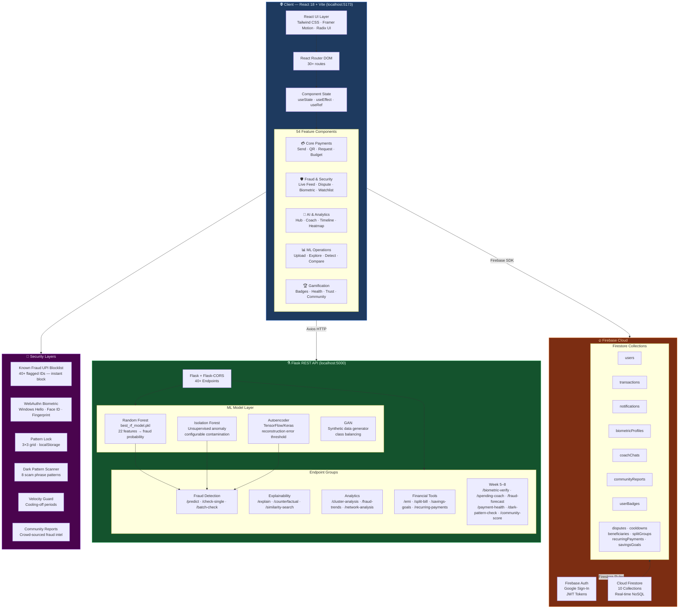
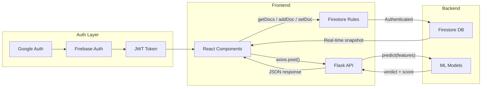
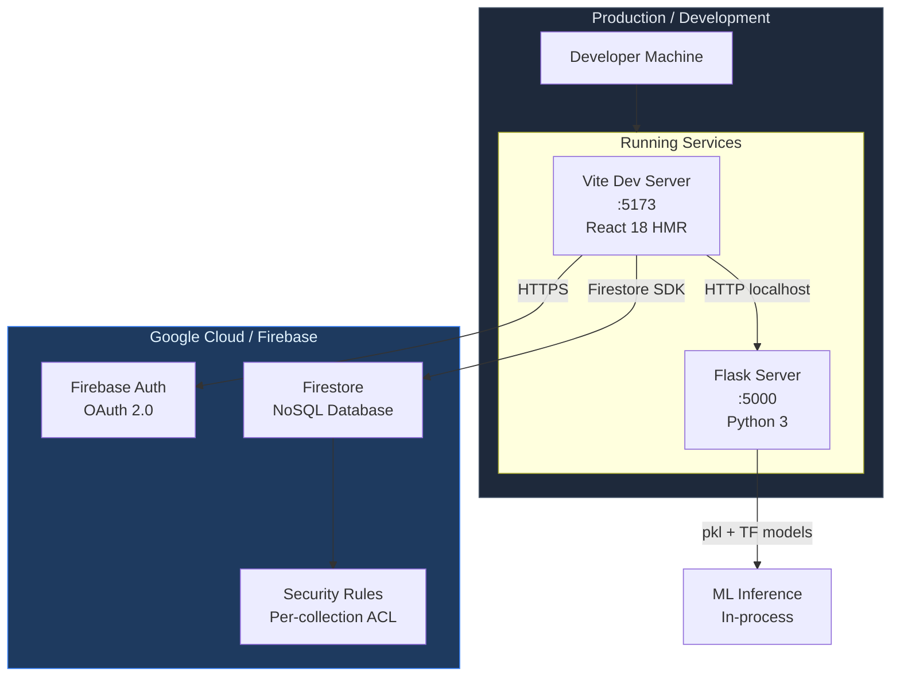

# AegisAI — System Architecture

> Render this file in GitHub, VS Code (Markdown Preview), or paste into [mermaid.live](https://mermaid.live)

---

## Full Stack Architecture



---

## Component Communication Pattern



---

## Fraud Decision Flow


```

---

## Infrastructure Overview


