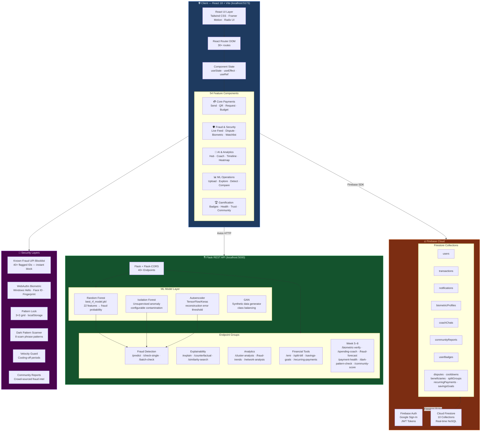
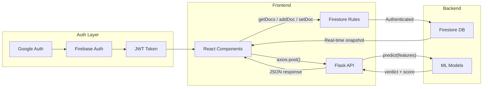
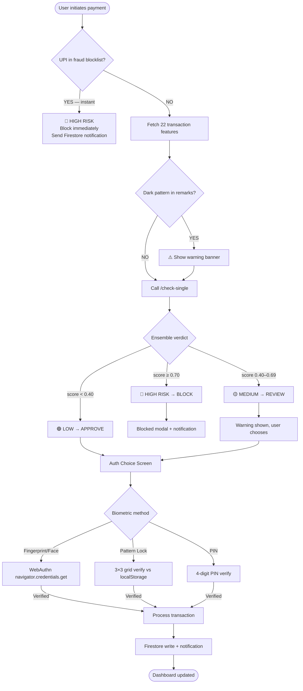
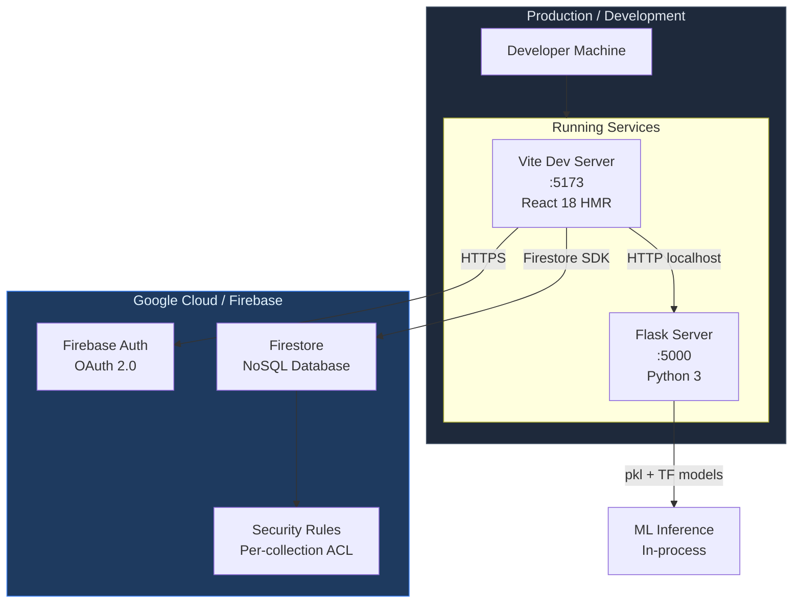
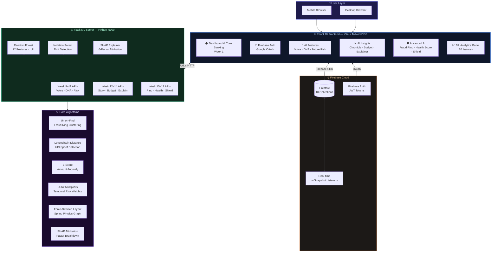
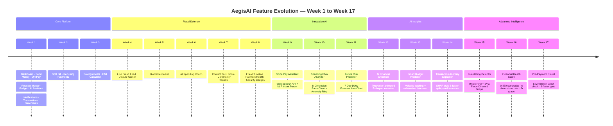
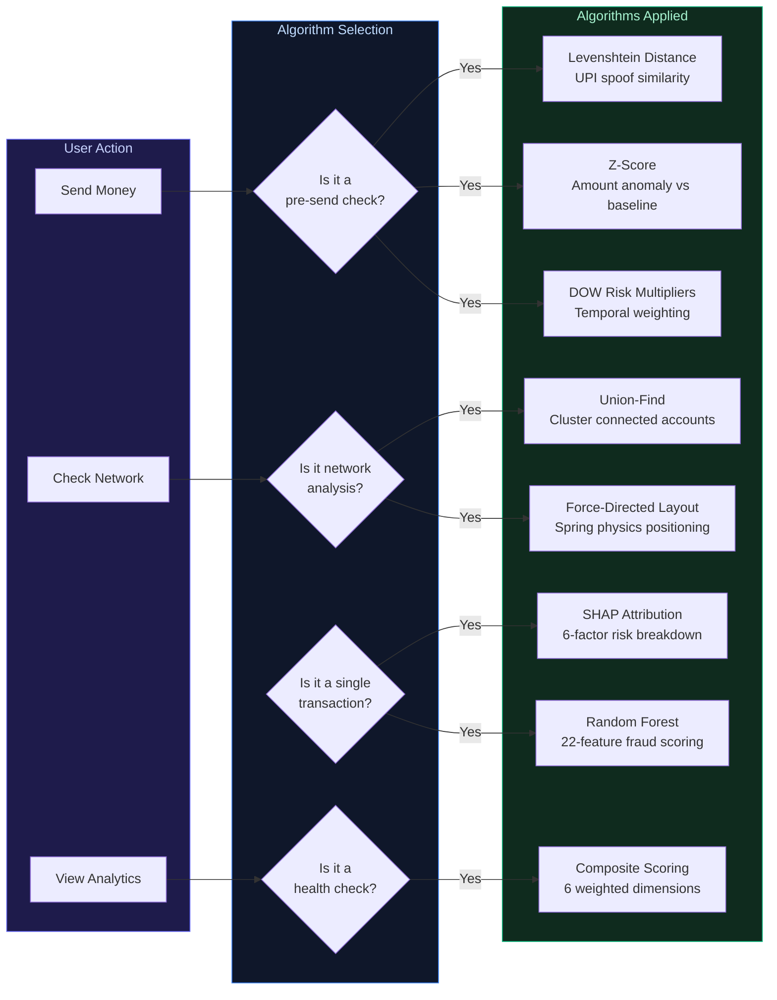

# AegisAI — System Architecture

> Render this file in GitHub, VS Code (Markdown Preview), or paste into [mermaid.live](https://mermaid.live)
> All diagrams are also pre-rendered as PNGs in `_render/`

---

## Rendered Diagram Gallery

### Diagram 07 — Full System Architecture


### Diagram 08 — Fraud Detection Pipeline


### Diagram 09 — Payment Journey Sequence


### Diagram 10 — Fraud Ring Algorithm


### Diagram 11 — Financial Health Score Model


### Diagram 12 — Feature Mind Map


### Diagram 13 — Data Flow Diagram


### Diagram 14 — Week-by-Week Evolution Timeline


---

## 1. Full Stack Architecture (Week 1–17) — Mermaid Source



---

## Component Communication Pattern



---

## Fraud Decision Flow


```

---

## Infrastructure Overview



---

---

## 2. Complete 5-Layer System Architecture (Week 9–17 Updated)




---

---

## 3. Week-by-Week Feature Evolution Timeline




---

---

## 4. Algorithm Decision Map


