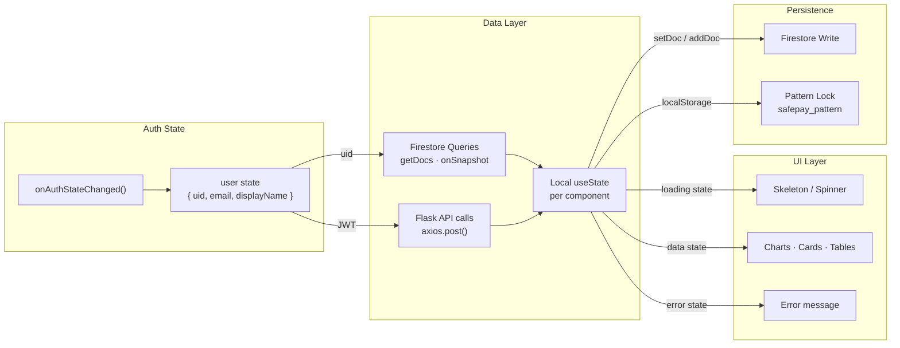
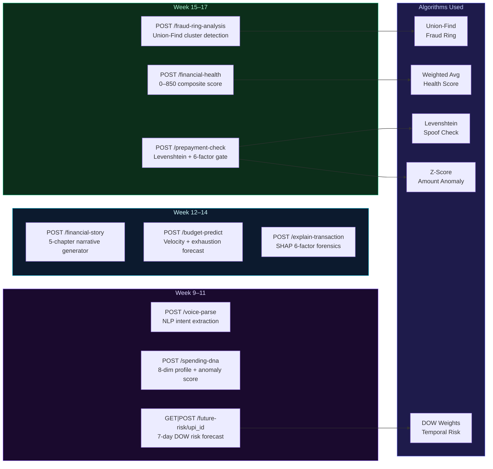
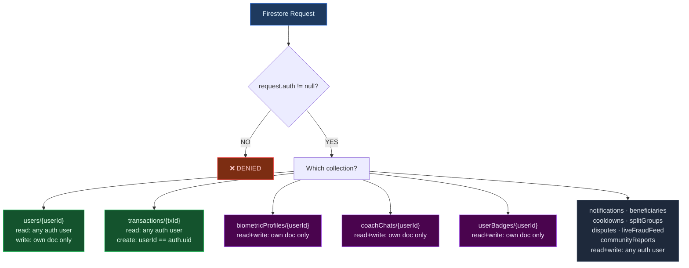

# AegisAI — Frontend Component Map

> Complete hierarchy of all 70+ React components across Week 1–17 feature delivery.
> Pre-rendered PNGs are embedded below each section where available.

---

## Pre-Rendered Diagram Gallery

### Complete Feature Mind Map (All 57 Routes)

### Full System Architecture

### Week-by-Week Evolution Timeline

---

## Full Component Hierarchy

```mermaid
graph TD
    APP["App.jsx<br/>React Router · 30+ routes"]

    subgraph LAYOUT["Shared Layout Components"]
        SB["SidebarContent.jsx<br/>Navigation · AegisAI brand · ML section"]
        HDR["Header.jsx<br/>User avatar · notification bell · balance"]
    end

    subgraph W1["Week 1 — Core Platform"]
        DASH["Dashboard.jsx<br/>Balance · Monthly trend · Category pie · Recent txns"]
        HOME["Homepage.jsx<br/>Send Money · UPI verify · Dark pattern check<br/>Known fraud blocklist · TransactionSimulation"]
        TSIM["TransactionSimulation.jsx<br/>Auth choice · WebAuthn · Pattern lock · PIN<br/>Processing · Success · Blocked · Error states"]
        QR["QRPay.jsx"]
        REQ["RequestMoney.jsx"]
        BUD["Budget.jsx<br/>Category limits · Live spend tracking"]
        AIA["AIAssistant.jsx<br/>Conversational fraud Q&A"]
        NOTIF["NotificationsCenter.jsx<br/>Fraud alerts · System messages"]
        HIST["Recent.jsx / Transactions.jsx"]
        STMT["Statements.jsx<br/>Date-filtered statements"]
        BEN["Beneficiaries.jsx"]
        SIGNIN["SignIn.jsx<br/>Google OAuth · First-login UPI assignment"]
    end

    subgraph W2["Week 2 — Smart Tools"]
        SPLIT["SplitBill.jsx<br/>Multi-contact expense splitter"]
        RECUR["RecurringPayments.jsx<br/>Schedule · next-date projection"]
    end

    subgraph W3["Week 3 — Savings & Planning"]
        SAV["SavingsGoals.jsx<br/>Visual progress · AI completion projection"]
        EMI["EMICalculator.jsx<br/>EMI · interest · amortization table"]
    end

    subgraph W4["Week 4 — Fraud Ops"]
        LIVE["LiveFraudFeed.jsx<br/>Real-time event stream"]
        DISP["DisputeCenter.jsx<br/>Raise · track · resolve disputes"]
    end

    subgraph W5["Week 5 — Biometric Security"]
        BIO["BiometricGuard.jsx<br/>Keystroke calibration · Firestore baseline<br/>Protection toggles"]
    end

    subgraph W6["Week 6 — AI Coach"]
        COACH["SpendingCoach.jsx<br/>Category pie · 7-day trend area chart<br/>AI insights · Coach chat · Persistence"]
    end

    subgraph W7["Week 7 — Social Trust"]
        TRUST["ContactTrustScore.jsx<br/>0–100 score · Conic-gradient gauge<br/>Trusted / Known / New / Suspicious bands"]
        COMM["CommunityReports.jsx<br/>Report feed · Corroborate voting · Leaderboard"]
    end

    subgraph W8["Week 8 — Intelligence"]
        FTL["FraudTimeline.jsx<br/>7-day risk forecast · Day-of-week factors"]
        PHLT["PaymentHealth.jsx<br/>SVG animated gauge · 5 sub-scores · A+→D grade"]
        BDGE["SecurityBadges.jsx<br/>20 badges · XP system · Streak · Levels"]
    end

    subgraph MLSUITE["ML Analytics Suite"]
        UP["UploadData.jsx<br/>CSV upload · AI quality grade A–D"]
        EXP["ExploreData.jsx<br/>Stats · Correlation matrix · Daily volume"]
        RUN["RunDetection.jsx<br/>Quick / Balanced / Precision presets"]
        DRES["DetectionResults.jsx<br/>Confusion matrix · ROC · Distribution"]
        MC["ModelComparison.jsx<br/>RF vs IF vs AE metrics"]
        CT["CheckTransaction.jsx<br/>Arc gauge · Risk badge · Suspicious features"]
        BC["BatchCheck.jsx<br/>50-tx bulk prediction table"]
        AIHB["AIHub.jsx<br/>NL summary · Clusters · Velocity trends"]
        FI["FeatureInsights.jsx<br/>Feature importance bar chart"]
        BE["BulkExplain.jsx<br/>Batch z-scores · percentiles"]
        SH["ScoreHistory.jsx<br/>Audit log of all scored transactions"]
        WL["Watchlist.jsx<br/>Monitor specific UPIs"]
        FC["FraudCalendar.jsx<br/>Day/hour heatmap"]
        NA["NetworkAnalysis.jsx<br/>Transaction graph · fraud rings"]
        DD["DatasetDrift.jsx<br/>Statistical drift detection"]
        RR["RetrainingReadiness.jsx<br/>Model staleness assessment"]
        BA["BehavioralAnalysis.jsx<br/>User pattern profiling"]
        RE["RuleEngine.jsx<br/>Configurable fraud rules"]
        RSB["RiskScoreBlend.jsx<br/>Multi-model weight aggregation"]
        FBC["FeedbackCenter.jsx<br/>False positive / negative reporting"]
        RP["RiskProfile.jsx<br/>Percentile risk profiling"]
        FH["FraudHeatmap.jsx<br/>Geographic fraud density"]
    end

    subgraph W911["Week 9–11 — Innovative AI"]
        VOICE["VoicePayAssistant.jsx<br/>Web Speech API · 28-bar waveform<br/>NLP intent parser · Command history"]
        DNA["SpendingDNA.jsx<br/>8-dim behavioral profile<br/>RadarChart baseline vs current<br/>SVG anomaly ring"]
        FUTURE["FutureRiskPredictor.jsx<br/>4-factor scoring · DOW multipliers<br/>7-day AreaChart · UPI quick check"]
    end

    subgraph W1214["Week 12–14 — AI Insights"]
        STORY["AIFinancialStory.jsx<br/>5-chapter typewriter narrative<br/>Book-cover pre-gen screen<br/>Framer Motion character animation"]
        BUDGET["BudgetPredictor.jsx<br/>Daily velocity tracking<br/>Month-end projection curve<br/>Exhaustion date alert"]
        EXPLAINER["AnomalyExplainer.jsx<br/>Split-panel forensic UI<br/>SHAP-style 6-factor bars<br/>RadarChart + SVG score ring"]
    end

    subgraph W1517["Week 15–17 — Advanced AI"]
        RING["FraudRingDetector.jsx<br/>Union-Find clustering<br/>SVG force-directed graph<br/>Pan · zoom · drag · node inspector"]
        HEALTH["FinancialHealthScore.jsx<br/>0–850 composite score<br/>6-dimension RadarChart<br/>4-week trend · letter grade"]
        SHIELD["PrePaymentShield.jsx<br/>Levenshtein spoof check<br/>6-factor real-time gate<br/>Green/Yellow/Red verdict"]
    end

    subgraph UTIL["Utility"]
        SET["Settings.jsx"]
        HELP["HelpSupport.jsx<br/>Ticket submission"]
    end

    APP --> LAYOUT
    APP --> SIGNIN
    APP --> W1 & W2 & W3 & W4 & W5 & W6 & W7 & W8 & MLSUITE & UTIL
    APP --> W911 & W1214 & W1517

    SB & HDR -.->|"used by all pages"| W1
    HOME --> TSIM

    style APP fill:#1e3a5f,stroke:#3b82f6,color:#e0f2fe
    style LAYOUT fill:#1e293b,stroke:#475569,color:#e2e8f0
    style W1 fill:#14532d,stroke:#22c55e,color:#dcfce7
    style W2 fill:#1e3a5f,stroke:#60a5fa,color:#e0f2fe
    style W3 fill:#4a044e,stroke:#a855f7,color:#f3e8ff
    style W4 fill:#7c2d12,stroke:#f97316,color:#fed7aa
    style W5 fill:#1e293b,stroke:#06b6d4,color:#cffafe
    style W6 fill:#064e3b,stroke:#10b981,color:#d1fae5
    style W7 fill:#172554,stroke:#6366f1,color:#e0e7ff
    style W8 fill:#713f12,stroke:#eab308,color:#fef9c3
    style MLSUITE fill:#0f172a,stroke:#94a3b8,color:#e2e8f0
    style W911 fill:#1a0a2e,stroke:#8b5cf6,color:#ddd6fe
    style W1214 fill:#0c1a2e,stroke:#06b6d4,color:#cffafe
    style W1517 fill:#0c2e1a,stroke:#10b981,color:#a7f3d0
    style UTIL fill:#1e293b,stroke:#475569,color:#e2e8f0
```

---

## State Management Pattern

---

## Route Map

```mermaid
graph LR
    subgraph PUBLIC["Public Routes"]
        R0["/  →  SignIn.jsx"]
    end

    subgraph PAYMENTS["Payment Routes"]
        R1["/dashboard  →  Dashboard.jsx"]
        R2["/send-money  →  Homepage.jsx"]
        R3["/qr-pay  →  QRPay.jsx"]
        R4["/request-money  →  RequestMoney.jsx"]
        R5["/transactions  →  Transactions.jsx"]
        R6["/statements  →  Statements.jsx"]
        R7["/beneficiaries  →  Beneficiaries.jsx"]
        R8["/budget  →  Budget.jsx"]
        R9["/notifications  →  NotificationsCenter.jsx"]
        R10["/ai-assistant  →  AIAssistant.jsx"]
    end

    subgraph TOOLS["Financial Tools"]
        R11["/split-bill  →  SplitBill.jsx"]
        R12["/recurring-payments  →  RecurringPayments.jsx"]
        R13["/savings-goals  →  SavingsGoals.jsx"]
        R14["/emi-calculator  →  EMICalculator.jsx"]
    end

    subgraph FRAUD["Fraud & Security"]
        R15["/live-fraud-feed  →  LiveFraudFeed.jsx"]
        R16["/dispute-center  →  DisputeCenter.jsx"]
        R17["/biometric-guard  →  BiometricGuard.jsx"]
        R18["/spending-coach  →  SpendingCoach.jsx"]
        R19["/contact-trust  →  ContactTrustScore.jsx"]
        R20["/community-reports  →  CommunityReports.jsx"]
        R21["/fraud-timeline  →  FraudTimeline.jsx"]
        R22["/payment-health  →  PaymentHealth.jsx"]
        R23["/security-badges  →  SecurityBadges.jsx"]
        R24["/risk-profile  →  RiskProfile.jsx"]
        R25["/fraud-heatmap  →  FraudHeatmap.jsx"]
    end

    subgraph ML["ML Analytics"]
        R26["/upload-data  →  UploadData.jsx"]
        R27["/explore-data  →  ExploreData.jsx"]
        R28["/run-detection  →  RunDetection.jsx"]
        R29["/detection-results  →  DetectionResults.jsx"]
        R30["/model-comparison  →  ModelComparison.jsx"]
        R31["/check-transaction  →  CheckTransaction.jsx"]
        R32["/batch-check  →  BatchCheck.jsx"]
        R33["/ai-hub  →  AIHub.jsx"]
        R34["/feature-insights  →  FeatureInsights.jsx"]
        R35["/bulk-explain  →  BulkExplain.jsx"]
        R36["/score-history  →  ScoreHistory.jsx"]
        R37["/watchlist  →  Watchlist.jsx"]
        R38["/fraud-calendar  →  FraudCalendar.jsx"]
        R39["/network-analysis  →  NetworkAnalysis.jsx"]
        R40["/dataset-drift  →  DatasetDrift.jsx"]
        R41["/retraining-readiness  →  RetrainingReadiness.jsx"]
        R42["/behavioral-analysis  →  BehavioralAnalysis.jsx"]
        R43["/rule-engine  →  RuleEngine.jsx"]
        R44["/risk-score-blend  →  RiskScoreBlend.jsx"]
        R45["/feedback-center  →  FeedbackCenter.jsx"]
    end

    subgraph AI911["Week 9–11 Innovative AI"]
        R48["/voice-pay  →  VoicePayAssistant.jsx"]
        R49["/spending-dna  →  SpendingDNA.jsx"]
        R50["/future-risk  →  FutureRiskPredictor.jsx"]
    end

    subgraph AI1214["Week 12–14 AI Insights"]
        R51["/financial-story  →  AIFinancialStory.jsx"]
        R52["/budget-predictor  →  BudgetPredictor.jsx"]
        R53["/anomaly-explainer  →  AnomalyExplainer.jsx"]
    end

    subgraph AI1517["Week 15–17 Advanced AI"]
        R54["/fraud-ring  →  FraudRingDetector.jsx"]
        R55["/health-score  →  FinancialHealthScore.jsx"]
        R56["/prepayment-shield  →  PrePaymentShield.jsx"]
    end

    subgraph UTIL2["Utility"]
        R46["/settings  →  Settings.jsx"]
        R47["/help-support  →  HelpSupport.jsx"]
    end

    style PUBLIC fill:#1e293b,stroke:#475569,color:#e2e8f0
    style PAYMENTS fill:#14532d,stroke:#22c55e,color:#dcfce7
    style TOOLS fill:#1e3a5f,stroke:#3b82f6,color:#e0f2fe
    style FRAUD fill:#4a044e,stroke:#a855f7,color:#f3e8ff
    style ML fill:#0f172a,stroke:#94a3b8,color:#e2e8f0
    style AI911 fill:#1a0a2e,stroke:#8b5cf6,color:#ddd6fe
    style AI1214 fill:#0c1a2e,stroke:#06b6d4,color:#cffafe
    style AI1517 fill:#0c2e1a,stroke:#10b981,color:#a7f3d0
    style UTIL2 fill:#1e293b,stroke:#475569,color:#e2e8f0
```

---

## Flask API Map (Week 9–17)

---

## Firestore Security Rule Map

