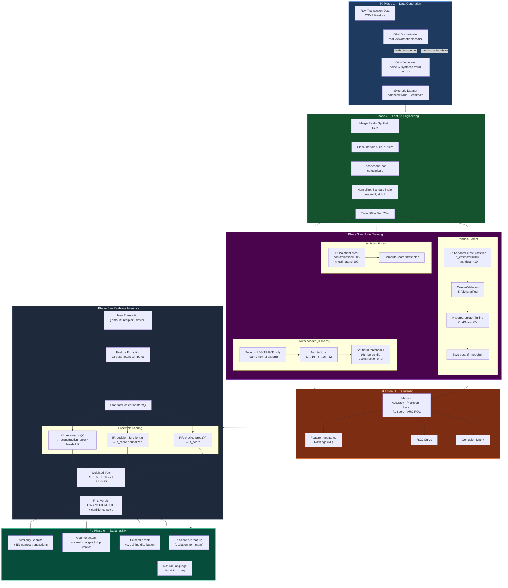
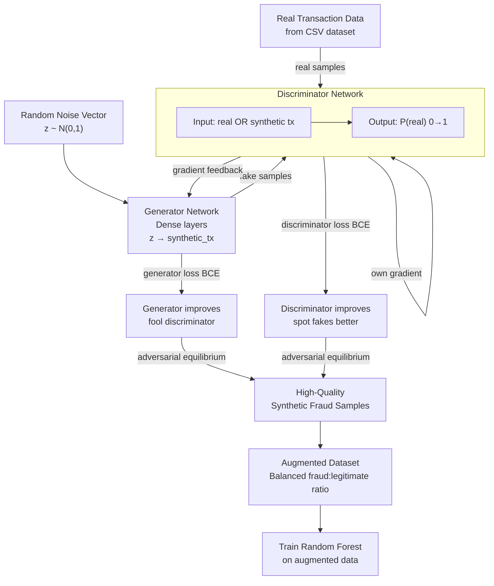
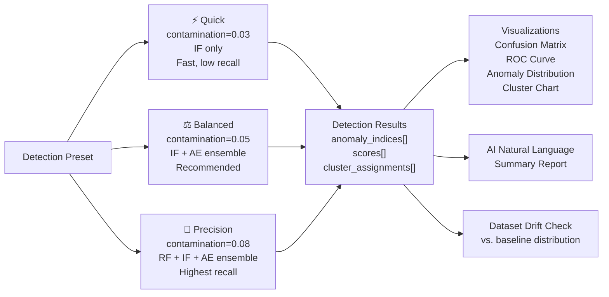

# AegisAI — ML Data Flow & Pipeline

> GAN training, feature engineering, and real-time inference pipeline

---

## Complete ML Pipeline

---

## Feature Engineering Pipeline

```mermaid
flowchart LR
    subgraph INPUT["Raw Transaction"]
        A1["amount"]
        A2["recipient_upi"]
        A3["sender_upi"]
        A4["timestamp"]
        A5["device_id"]
        A6["location"]
        A7["remarks"]
    end

    subgraph DERIVED["Derived Features (22 total)"]
        direction TB
        F1["Amount Features<br/>raw amount<br/>normalized amount<br/>high-value flag"]
        F2["Velocity Features<br/>tx frequency (24h)<br/>time since last tx<br/>daily limit exceeded"]
        F3["Trust Features<br/>recipient blacklist<br/>verification status<br/>social trust score<br/>fraud complaint count"]
        F4["Device Features<br/>device fingerprint risk<br/>VPN/proxy usage<br/>behavioral biometrics"]
        F5["Location Features<br/>geo-normal flag<br/>geo-unusual flag<br/>location inconsistency"]
        F6["Temporal Features<br/>high-risk time window<br/>past fraud flags"]
        F7["Context Features<br/>merchant category match<br/>transaction context anomaly<br/>account age"]
    end

    INPUT --> DERIVED

    DERIVED --> SCALER["StandardScaler<br/>μ=0, σ=1"]
    SCALER --> MODELS["RF · IF · AE<br/>Ensemble"]
```

---

## GAN Training Flow

---

## Anomaly Detection Modes

