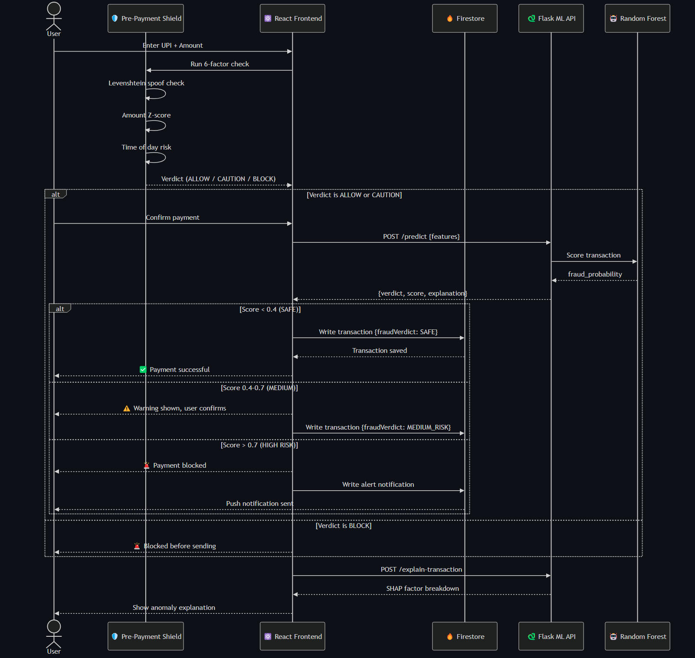
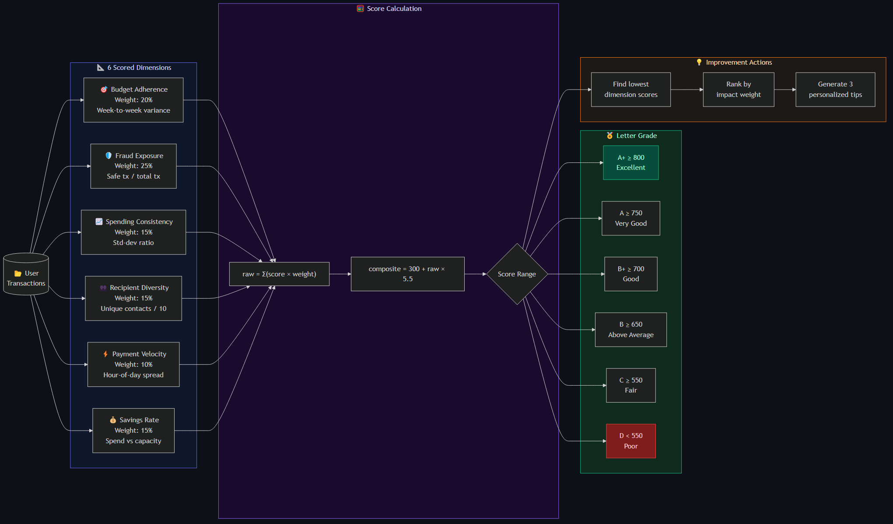
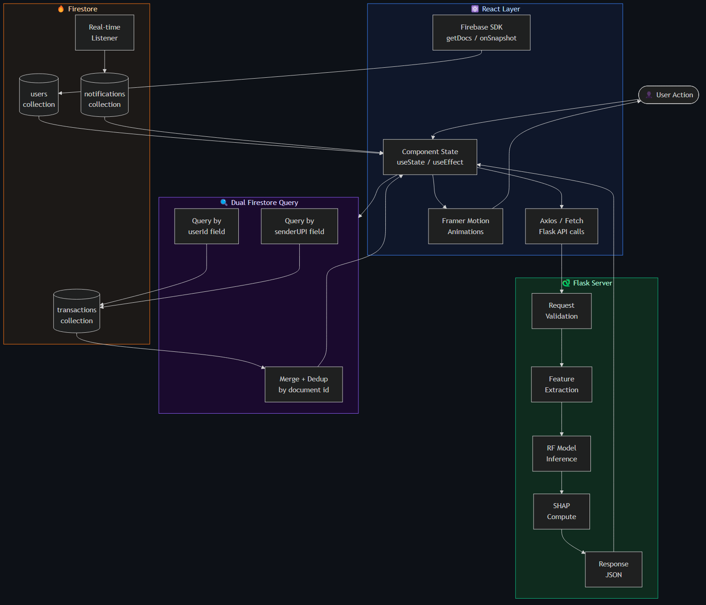

# AegisAI — System Design Diagrams Index

> All diagrams rendered with `mmdc` (Mermaid CLI) · dark theme · `#0d1117` background
> Open this file in GitHub or VS Code Markdown Preview to see all images inline.

---

## Diagram 07 — Full System Architecture
> 5-layer architecture: User → React → Firebase → Flask → Algorithms · Week 1–17 complete view


---

## Diagram 08 — Fraud Detection Pipeline
> End-to-end flow: transaction → Pre-Payment Shield → ML scoring → SHAP explainer → Green/Yellow/Red verdict


---

## Diagram 09 — Payment Journey Sequence
> Actor-level sequence diagram across React, Firebase, and Flask for a complete send-money lifecycle



---

## Diagram 10 — Fraud Ring Detector Algorithm
> Step-by-step: graph construction → Union-Find clustering → risk propagation → force-directed SVG layout


---

## Diagram 11 — Financial Health Score Model
> 6 weighted dimensions → composite 300–850 score → letter grade A+→D → ranked improvement actions



---

## Diagram 12 — Feature Mind Map
> Complete mind map of all 57 features organized by category across Weeks 1–17


---

## Diagram 13 — Data Flow Diagram
> Dual Firestore query strategy (userId + senderUPI), real-time listeners, React ↔ Flask API orchestration



---

## Diagram 14 — Feature Evolution Timeline
> Week-by-week chronological rollout from core banking (Week 1) to advanced AI intelligence (Week 17)


---

## Legacy Diagrams (Week 1–8)

### Diagram 01 — Original System Architecture


### Diagram 02 — Fraud Decision Flow


### Diagram 03 — ML Pipeline


### Diagram 04 — Payment Sequence


### Diagram 05 — Biometric Sequence


### Diagram 06 — Component Map


---

## Mermaid Source Files

| File | Contents |
|------|----------|
| [ARCHITECTURE.md](./ARCHITECTURE.md) | Full stack architecture · Timeline · Algorithm decision map |
| [SEQUENCE_DIAGRAMS.md](./SEQUENCE_DIAGRAMS.md) | 10 sequence diagrams covering all major user flows |
| [DATA_FLOW.md](./DATA_FLOW.md) | ML pipeline · Feature engineering · Week 9–17 data flows |
| [COMPONENT_MAP.md](./COMPONENT_MAP.md) | 70+ component hierarchy · All 57 routes · Flask API map |

---

## Feature-to-Diagram Coverage

| Feature | PNG | Mermaid Source |
|---------|-----|----------------|
| System Architecture | 07, 01 | ARCHITECTURE.md §1, §2 |
| Fraud Pipeline | 08, 02 | ARCHITECTURE.md § Fraud Decision Flow |
| Payment Send Flow | 09, 04 | SEQUENCE_DIAGRAMS.md §2 |
| Biometric Auth | 05 | SEQUENCE_DIAGRAMS.md §4 |
| ML Ensemble Scoring | 03 | SEQUENCE_DIAGRAMS.md §3 · DATA_FLOW.md |
| Spending Coach | — | SEQUENCE_DIAGRAMS.md §5 |
| Community Reports | — | SEQUENCE_DIAGRAMS.md §6 |
| Voice Pay (Week 9) | — | SEQUENCE_DIAGRAMS.md §7 · DATA_FLOW.md |
| Spending DNA (Week 10) | — | DATA_FLOW.md |
| Future Risk (Week 11) | — | DATA_FLOW.md |
| Budget Predictor (Week 13) | — | DATA_FLOW.md |
| Fraud Ring Detector (Week 15) | 10 | SEQUENCE_DIAGRAMS.md §9 · DATA_FLOW.md |
| Financial Health Score (Week 16) | 11 | SEQUENCE_DIAGRAMS.md §10 |
| Pre-Payment Shield (Week 17) | — | SEQUENCE_DIAGRAMS.md §8 · DATA_FLOW.md |
| All Features Mind Map | 12 | COMPONENT_MAP.md |
| All 57 Routes | — | COMPONENT_MAP.md § Route Map |
| Flask API Map | — | COMPONENT_MAP.md § Flask API Map |
| Feature Evolution | 14 | ARCHITECTURE.md §3 |

---

## How to Re-render PNGs

```bash
# Install mmdc
npm install -g @mermaid-js/mermaid-cli

# Render all diagrams (run from _render/ folder)
cd SystemDesignDiagrams/_render

mmdc -i 07_full_architecture.mmd       -o 07_full_architecture.png       -t dark -b "#0d1117" --width 2400 --height 1600
mmdc -i 08_fraud_detection_pipeline.mmd -o 08_fraud_detection_pipeline.png -t dark -b "#0d1117" --width 2400 --height 1600
mmdc -i 09_payment_journey.mmd         -o 09_payment_journey.png         -t dark -b "#0d1117" --width 2400 --height 1600
mmdc -i 10_fraud_ring_algorithm.mmd    -o 10_fraud_ring_algorithm.png    -t dark -b "#0d1117" --width 2400 --height 1600
mmdc -i 11_health_score_model.mmd      -o 11_health_score_model.png      -t dark -b "#0d1117" --width 2400 --height 1600
mmdc -i 12_feature_map.mmd            -o 12_feature_map.png            -t dark -b "#0d1117" --width 2800 --height 2000
mmdc -i 13_data_flow.mmd              -o 13_data_flow.png              -t dark -b "#0d1117" --width 2400 --height 1600
mmdc -i 14_week_evolution.mmd         -o 14_week_evolution.png         -t dark -b "#0d1117" --width 3000 --height 1400
```
