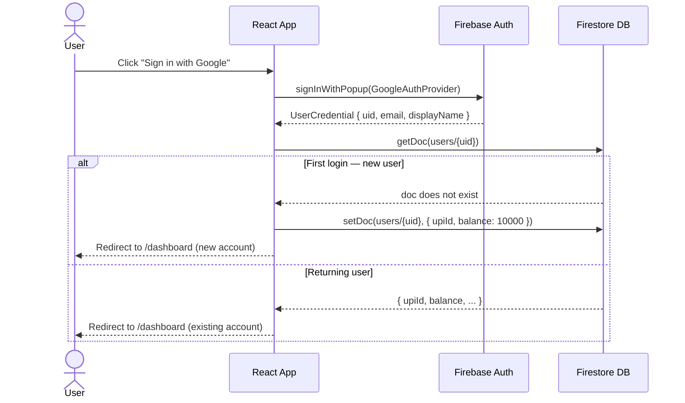
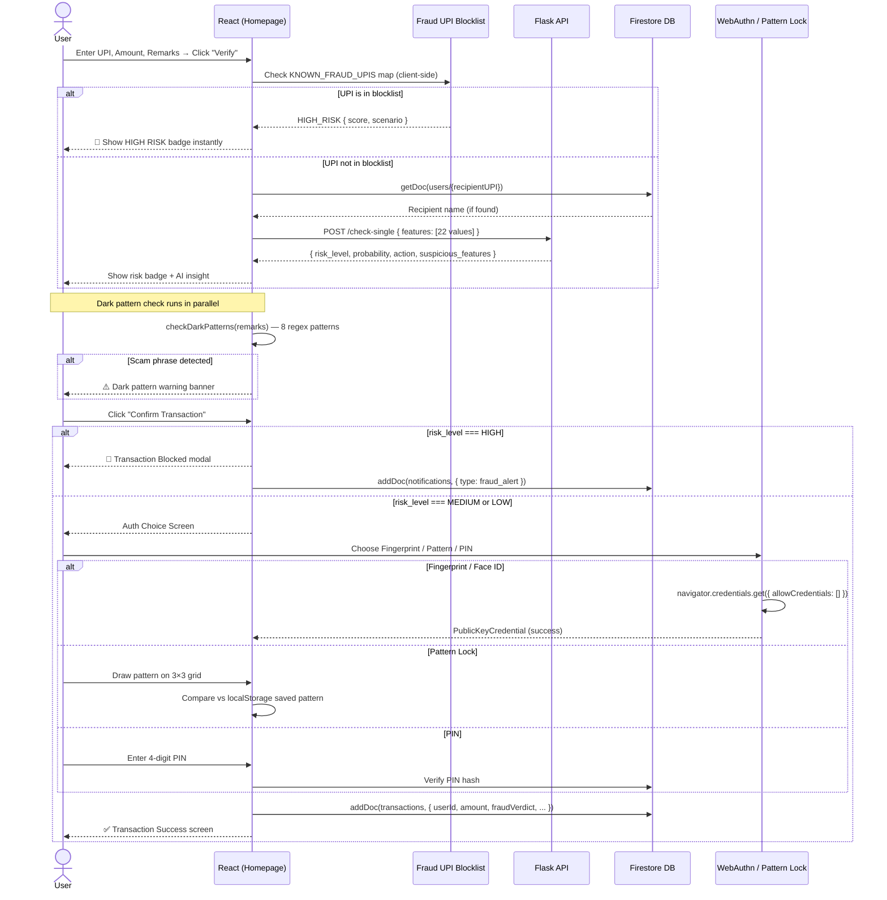
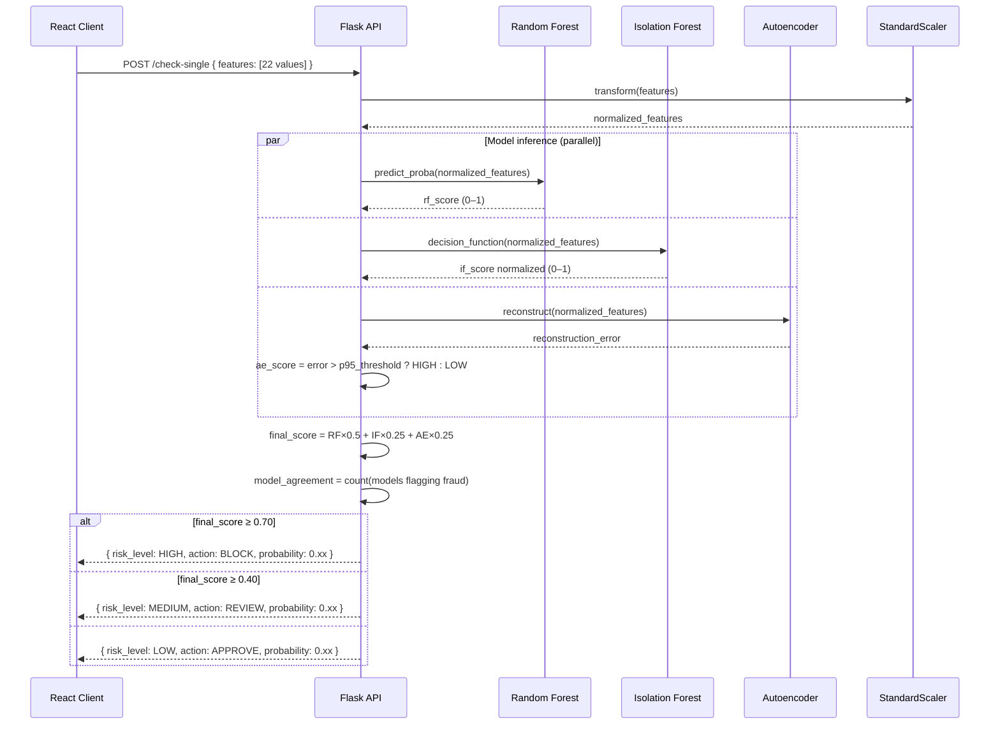
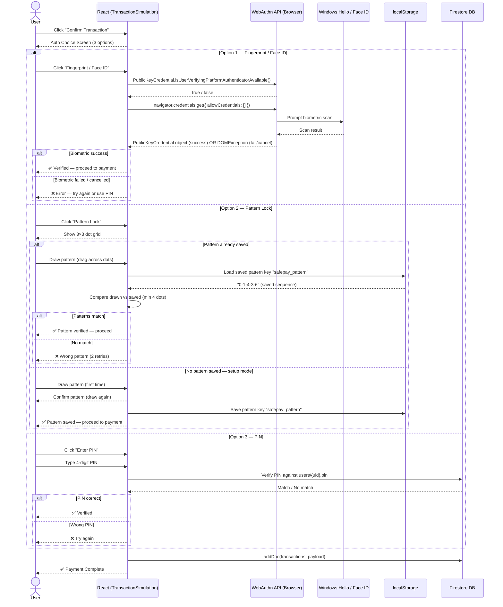
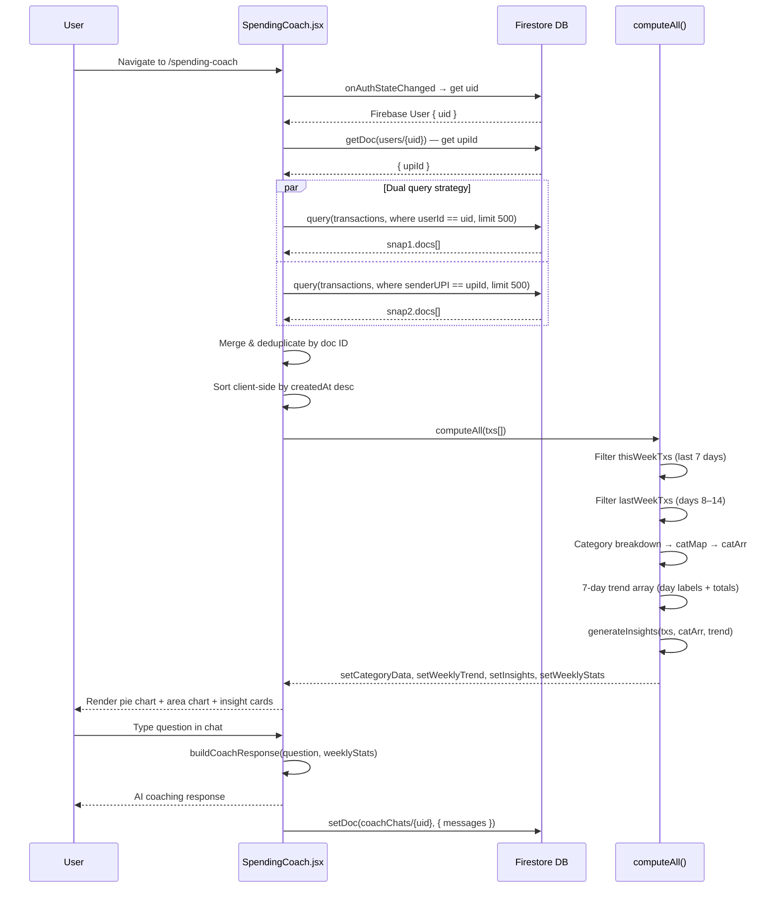
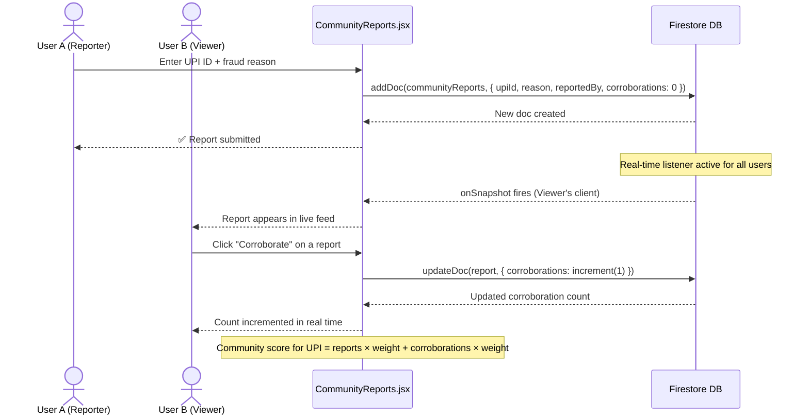

# AegisAI — Sequence Diagrams

> Paste any diagram into [mermaid.live](https://mermaid.live) to render interactively.

---

## 1. User Login & UPI Assignment

---

## 2. Send Money — Full Fraud Verification Flow

---

## 3. ML Fraud Detection — Ensemble Pipeline

---

## 4. Biometric Authentication Flow

---

## 5. Spending Coach Data Flow

---

## 6. Community Fraud Report Flow

